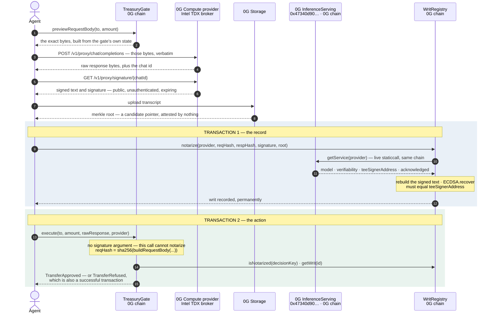

# Writ

Writ verifies a 0G Compute TEE inference proof inside a smart contract on 0G, records it
permanently, and lets other contracts act on the verified decision — refusals included.

Reviewing this? Start at **[`JUDGES.md`](JUDGES.md)** — a five-minute path, no credentials, no
install, no funds. The full ledger of what is and is not claimed is in
**[`CLAIMS.md`](CLAIMS.md)**, including the NOT-CLAIMED list. Read it adversarially; that is what
it is for.

---

## This is the closing move on a known problem, not a discovery

Client-side verification of 0G's TEE inference proofs already exists. **0G's own SDK does it**, and
at least one other buildathon entry implements the full off-chain check in the browser. None of
that is Writ's contribution and Writ does not claim it.

The contribution is moving the check **across the contract boundary**, so the proof becomes
permanent, public, and executable by other contracts.

There is one sharp technical difference, and it is worth stating precisely.

In `0g-compute-ts-sdk` (v0.9.0, commit `3e833e2`), `Verifier.verifySignature`
(`src.ts/sdk/inference/broker/verifier.ts:883`) takes a `message` string, hashes it with
`ethers.hashMessage`, recovers, and compares. Its only caller
(`src.ts/sdk/inference/broker/response.ts:98`) passes `ResponseSignature.text` — **whatever text
the provider returned** from `/v1/proxy/signature/{chatID}`. The client never rebuilds that text
from the bytes it actually sent and received. So the check proves the TEE signed *something*; it
does not prove the signed statement is about *your* request.

0G's own documentation draws the same line. Its "Independent verification" section lists four steps
for verifying from scratch, and the fourth is:

> 4. Confirm the signed `text` matches the response content you received from the Router.

`processResponse` performs the first three. It cannot perform the fourth, and the helper's own
signature is the reason: `processResponse(providerAddress, chatID?, content?)` never receives the
request body or the response body — `content` is a usage JSON used to compute the fee. Nothing in
scope for that function could be compared against the signed text.

**That is a scope limitation of a client-side convenience helper, not a vulnerability in 0G.** The
helper does what it says: it is a signature check, not a binding check. 0G's own protocol design
puts the binding on the verifier. `0g-pc-e2ee`'s `protocol/proof/proof.go` is explicit about it —
`BindingHash` is documented as "the single definition of the convention; the broker and the client
MUST both route through it … so the bytes cannot drift", and the `signing_address` field carries
the comment "it is a HINT for logging only — verification MUST anchor on the on-chain acknowledged
`teeSignerAddress`, never on this field". Writ follows both instructions; the SDK helper is simply
not where that work was meant to happen.

Writ reconstructs the signed text **on chain**, from `sha256(request)` and `sha256(response)`,
where the request half is a hash the calling contract computed from its own state rather than one
anybody handed it. That reconstruction is what makes the prompt-swap defence possible at all.

---

## The gap

A 0G Compute provider runs a model inside an Intel TDX enclave and signs a text binding the
request to the response with a hardware key whose address is published on chain in 0G's
`InferenceServing` contract. That signature is real, checkable, and today it goes nowhere.

**It is private.** Verification happens in a client, so what you end up holding is a report rather
than a fact: nobody else can recompute it from public data, and no contract can act on it. 0G says
this about the hosted path themselves, and better than we would — `0gfoundation/0g-doc` at
`df02a0c`, `docs/developer-hub/building-on-0g/compute-network/router/features/verifiable-execution.md`,
under "Trust model":

> `verify_tee: true` asks the **Router** to fetch the provider's TEE signature, look up the signer
> address on-chain, and verify the signature on your behalf. The Router returns a single boolean
> (`tee_verified`) summarising that check.
>
> In other words, `tee_verified: true` in the response says *"the Router says it verified the
> signature."* It does **not** carry the raw signature back to you — you still have to trust the
> Router to have done the check honestly.

The same page is equally clear that this is a choice rather than a limit: "all the inputs the
Router uses are public", and it lists the steps to reproduce the check yourself. Either way the
result stops at the party that ran it. Writ's difference is not that it verifies — it is where the
verification lands.

**It expires.** `GET {providerUrl}/v1/proxy/signature/{chatID}` is public and unauthenticated, but
brokers cache signatures with a TTL. A live mainnet provider answers an unknown chat id with,
verbatim:

```json
{"error":"prepare HTTP request: Chat id not found or expired, chat_id_not_found"}
```

Miss the window and the evidence is gone. There is no re-derivation and no way to compel a
provider to produce it after the fact.

**Nothing lands on chain.** This is not an oversight — 0G says so themselves. From
`0gfoundation/0g-agentic-id`, [`REPUTATION_MODEL.md`](https://github.com/0gfoundation/0g-agentic-id/blob/main/REPUTATION_MODEL.md),
principle 1, on where verifiable-AI facts should be aggregated:

> Rich aggregation is computed off-chain (SDK / indexer); it's zero-gas, unlimited scale, and
> freely iterable. **On-chain aggregation is only warranted when another contract must consume the
> score trustlessly — not our case today.**

Writ is exactly the case that clause carves out. A contract has to consume the decision
trustlessly, so the verification has to happen where the contract can see it. **Writ is
complementary to `0g-agentic-id`, not competing with it** — that project builds agent identity and
reputation over 0G; Writ is the on-chain settlement of a single inference proof. One answers *who
is this agent*; the other answers *which model said what, to which question*.

---

## How it works

A `PolicyGate` holds a question it will ask and a rule for accepting the answer, both fixed at
construction. The agent never composes the question — it reads the exact bytes out of the contract
and posts those.

```
1. The contract builds the question    promptHead ‖ params ‖ promptTail, where params are nine
                                       facts derived from the contract's own state.

2. Inference                           Non-streaming POST of those exact bytes. The raw response
                                       text is captured before any parsing.

3. The proof is claimed                GET /v1/proxy/signature/{chatId} — immediately, because
                                       it expires.

4. Archive                             Transcript uploaded to 0G Storage. The merkle root is a
                                       CANDIDATE pointer; nothing attests it.

5. Notarize        (transaction 1)     WritRegistry reads 0G's live InferenceServing on the same
                                       chain, rebuilds the signed text from the two hashes,
                                       recovers the signer, compares it to the provider's
                                       registered teeSignerAddress. Recorded forever.

6. Settle          (transaction 2)     The gate rebuilds its OWN question from its OWN state,
                                       hashes it with the sha256 precompile, and requires a writ
                                       to ALREADY EXIST under exactly that hash. Then it parses
                                       the verdict out of the revealed response bytes and acts.
```



**Two transactions, and the split is enforced on chain.** `PolicyGate._consume` takes no signature
and cannot notarize; it reverts `WritNotNotarized(bytes32)` if the writ is not already recorded. A
gate that notarized inline would put the permanent record and the guarded action in one
transaction, so an approval whose payout reverted would roll the record back with it — refusals
would be permanent and failed approvals would leave nothing. Pinned by
`contracts/test/AgentTreasury.t.sol::test_aRevertingRecipientLeavesTheNotarizationIntact`.

**A refusal is a success.** The transaction mines, `TransferRefused` is emitted, the counters
advance, no funds move, and the refusal is on chain forever. The gate also names *who* said no:
`Refusal.Model` for a `DENY`, `Refusal.Policy` for an `ALLOW` scored above the gate's ceiling.

**A prompt cannot be swapped.** The signature binds the request hash, and the contract computes
that hash itself from `buildRequestBody`. A genuine, valid TEE signature over a friendlier
question notarizes fine — as an answer to *that* question, under *that* request hash — and then
finds no writ waiting under the gate's own. `AgentTreasury.t.sol::test_refusesPromptSwap` runs all
three steps, including the attacker's successful notarization.

Byte layouts, the EIP-191 length prefix, the reveal step, and a contract-by-contract reference are
in [`docs/architecture.md`](docs/architecture.md).

---

## What is load-bearing about 0G

Writ is not an application that happens to sit on 0G. It extends 0G's inference protocol at its
lowest level — the TEE signature itself — and settles by calling 0G's own on-chain registry. There
is **no bridge, no admin key of ours, and no trusted relayer anywhere in the verification path.**

**0G Compute — the signature.** The proof Writ verifies is the broker's own EIP-191 signature over
its own signed text. Writ reproduces that text byte-for-byte in Solidity from 0G's Go source, not
from documentation:

- Format A, the plaintext chat proof: `sha256hex(req) ":" sha256hex(resp)`, **exactly 129 bytes**
  (`api/inference/internal/ctrl/signing.go:101-127`).
- Format B, the centralized routing proof: five colon-separated fields, the fifth being the
  **upstream's TLS certificate fingerprint** (`api/common/tee/tls.go:103-106`,
  `FormatRoutingProofText`). This binds strictly more than Format A: it names the upstream that
  actually served the request.

0G's broker produces more signed-text families than these two, and Writ implements exactly these
two. The image format
(`signImageResponse`) and the scheme-tagged E2EE family (`zg-sig-v1/e2ee-ct`, `…-ct-stream`,
`…/plain`, assembled in `0g-pc-e2ee/protocol/proof/proof.go`) are **not supported** and are not
verified. The E2EE family fails closed — three colon-separated fields, which no entry point
accepts. The single-image case is byte-identical to a chat proof and is **not** discriminated;
that is written down in [`CLAIMS.md`](CLAIMS.md) NOT-CLAIMED #13 rather than buried.

Format B is what most live mainnet providers actually produce: of the 19 acknowledged TeeML
services on chain 16661 today, **13 are `ProviderType: centralized`** and take the routing path.

**0G Chain — the registry read, on the same chain.** `WritRegistry.notarize` does a live
`staticcall` to 0G's deployed `InferenceServing` at
`0x47340d900bdFec2BD393c626E12ea0656F938d84` on every single call. Never a cached copy, never an
oracle of ours. It requires `verifiability == "TeeML"`, requires `teeSignerAcknowledged`, and
requires the recovered address to equal `teeSignerAddress`. This is only possible because 0G
Compute's registry and Writ's registry are the same chain — that is what removes the bridge.

**0G Storage — the transcript archive.** A writ proves two hashes. The transcript is how anyone
recovers the bytes those hashes commit to, in their own browser, from public data alone. Without
it the permanent record is a pair of hashes nobody outside the original run can interpret. The
archive is deliberately **not** part of the trust chain: a root is a claim by whoever published
it, it lives in an append-only candidate list rather than in the `Writ` struct, and a consumer
that finds no candidate re-deriving must report `unavailable`, never `fail`.

**Honest caveat on that third one:** the real uploader and the real downloader are wired in three
independent implementations, and only one of them — the SDK's — has actually run against the live
indexer. Both mainnet writs carry a transcript root that `https://indexer-storage-turbo.0g.ai`
serves; the app's browser-side download and the MCP server's are still exercised only against
stubbed `fetch`. See [`MOCKS.md`](MOCKS.md).

Remove 0G Compute and there is no signature to verify. Remove same-chain 0G Chain and the
verification needs a bridge or an oracle, at which point the guarantee is theirs and not the
enclave's. Remove 0G Storage and the record stops being readable by anyone but its author.

---

## What is in the repo

| Directory | What it is | Tests |
|---|---|---:|
| [`contracts/`](contracts) | Solidity 0.8.24. `WritLib` (text reconstruction + recovery), `VerdictLib` (verdict grammar), `PromptLib` (the `"model"` splice), `WritRegistry` (the permanent record, ownerless and non-upgradeable), `PolicyGate` (abstract base), `TreasuryGate` / `AgentTreasury` (the reference gate), `PolicyGateFactory`, `script/Deploy.s.sol` | **217** — 213 unit + 4 against a live 0G mainnet fork |
| [`sdk/`](sdk) | TypeScript client. Raw-byte inference, proof capture, local verification before anything is paid for, 0G Storage archival, notarization, and `checkProviderPassthrough` — the preflight that measures whether a provider's broker forwards a request body unmodified. Never hashes a re-serialized object | **134** |
| [`mcp/`](mcp) | MCP server — `writ_preview_question`, `writ_attest`, `writ_execute`, `writ_lookup`. Any MCP-speaking agent can produce and settle its own attested decisions. Install notes: [`mcp/README.md`](mcp/README.md) | **145** |
| [`app/`](app) | Next.js 16 / React 19 docket. `/` every decision, `/writ/[id]` one proof chain as four independently checkable rows plus a live tamper demo, `/studio` compose and deploy a policy, `/gate/[address]` one treasury. Notes: [`app/README.md`](app/README.md) | **126** |
| [`eval/`](eval) | Pre-registered scenarios, graded against a committed answer key, run end to end through the real SDK and the real contracts | 43 scenarios |

**622 tests in total**, all four suites re-run on 2026-08-28 for this README. Counts per suite:

```
contracts   217 passed, 0 failed    (forge test — includes the fork suite, so it needs network)
sdk         134 passed              (one test makes a real mainnet read)
mcp         145 passed              (no chain, no network)
app         126 passed              (no chain, no network)
```

The graded evaluation's committed scorecard (`eval/results/fork.json`, read back for this README):
43 scenarios, 43 ran, 0 errored, **0 false approvals**, 0 false refusals, 9 correct approvals, 34
correct refusals, 21/21 traps refused, 4/4 negative controls failed as designed, 0 mechanism
mismatches; 28 scenarios answered adversarially, 15 supplied a correct answer.

**Read what that scorecard is worth before you read the numbers.** It ran on a fork, where the
"TEE" is a key we generated and whoever holds the key decides what the "model" says. It measures
our enforcement machinery and **nothing about model judgement** — the artifact records
`modelBehaviourMeasured: false` in its own JSON. No `--live` run has happened. Details and the
full limitations list are in [`EVAL.md`](EVAL.md).

Supporting documents: [`CLAIMS.md`](CLAIMS.md) (every claim, tiered, plus NOT-CLAIMED),
[`MOCKS.md`](MOCKS.md) (the real-versus-simulated line), [`docs/architecture.md`](docs/architecture.md)
(the technical reference).

---

## Quick start

Needs Node 24, pnpm, and Foundry. **Everything below needs zero credentials and zero funds** — the
only network access is read-only RPC against 0G mainnet. The one command in this repository that
spends anything is called out separately at the end of this section.

```bash
git clone --recurse-submodules <this repo>
cd writ

# ── contracts: 217 tests. Build with --force first; a stale artifact silently skips suites.
cd contracts
forge build --force
forge test                       # expect: 217 tests passed, 0 failed

# the 4 tests that talk to 0G mainnet on their own — read-only, spends nothing
forge test --match-path test/WritRegistry.fork.t.sol -vv

# the gas figures in the table below, in the mode that produced them
forge test --match-test measures -vv

# a dry run of the real deployment: reads 0G mainnet, broadcasts nothing, costs nothing
forge script script/Deploy.s.sol --fork-url https://evmrpc.0g.ai

# ── the TypeScript side
cd ../sdk && pnpm install && pnpm test     # 134
cd ../mcp && pnpm install && pnpm test     # 145
cd ../app && pnpm install && pnpm test     # 126

# ── the local world: anvil forks 0G mainnet, the contracts deploy onto it, and 43
#    pre-registered scenarios run end to end through the real SDK and the real registry.
cd ../eval && pnpm install && pnpm eval:fork
```

The eval's fork boots `anvil --fork-url https://evmrpc.0g.ai`, so `WritRegistry` verifies against
0G's **real deployed** `InferenceServing` with its real storage. The eval's own provider is
registered through that contract's own `addOrUpdateService` — paying the stake it actually charges
— and acknowledged through its own `acknowledgeTEESignerByOwner`. Exactly one value is
substituted: the TEE private key, because an enclave key cannot be extracted.

One command that does spend something, and is worth the paragraph in the security model:

```bash
# needs WRIT_PRIVATE_KEY with a funded 0G compute ledger. Sends one minimal request.
cd sdk && pnpm tsx examples/check-provider.ts 0x7DCFe6AEa70350C2090041524c9B4A9262DCe87D
```

It reports `passthrough`, `response-only` or `unusable`, and exits 0, 1 or 2 so it can gate a
deploy script. Nothing else in this repository spends anything.

To browse the docket, `cd app && cp .env.example .env.local && pnpm dev`. The example file already
points at the mainnet deployment. Every value is `NEXT_PUBLIC_` — the app has no privileged read, so
a reviewer with the same values sees exactly the same pages. With no registry address set it states
the gap on the page rather than rendering an empty view that would read as "no activity yet".

---

## Security model, stated honestly

**What a verified writ says, and nothing more:** the address that 0G's `InferenceServing` names as
this provider's acknowledged TEE signer produced an EIP-191 signature over a text binding
`sha256(request)` to `sha256(response)` — and, on the routing path, to the upstream's TLS
certificate fingerprint.

**Writ proves which model was named, what it said, and to which question. It does not prove the
model is correct.** A model that confidently approves a theft produces a permanently recorded,
cryptographically attested, entirely wrong decision, and Writ will have done its job exactly.

**The trust base, named:**

1. **Intel TDX.** Writ verifies a secp256k1 signature. It does **not** verify a TDX quote, does
   not check measurement registers, does not check the `ImageDigest` a provider publishes, and
   does not talk to Intel's PCS. Everything to the left of the signature is inherited.
2. **0G's registry.** The only authority on which key an enclave signs with is
   `InferenceServing.getService(provider).teeSignerAddress`.
3. **A permissioned admin key.** `teeSignerAcknowledged` can only be set by
   `acknowledgeTEESignerByOwner(address)` — verified against the dispatch table of the deployed
   implementation, which contains that selector and contains no self-acknowledgement function. On
   mainnet the owner is `0xddCDcbD9C7aeFB165dE00CE8684907fAAe8C8224`. **If that key acknowledges a
   signer that is not really inside an enclave, every writ verifying against it is
   cryptographically valid and semantically worthless, and Writ has no way to notice.**

The acknowledgement is at least bound to the specific registration: changing the model name, the
`additionalInfo`, or the `teeSignerAddress` resets `teeSignerAcknowledged` to `false` — probed
field by field on a mainnet fork. Changing only the URL or the prices does not, so a provider can
silently repoint its endpoint.

**On-chain request binding needs a provider whose broker forwards the body unmodified, and not
every provider does.** 0G's broker takes a portable OpenAI-schema request and rewrites parts of it
before forwarding — `max_tokens` ↔ `max_completion_tokens`, `reasoning_effort` into one of five
upstream dialects, the `model` field to the upstream id — and then signs what it forwarded
(`0g-serving-broker`, `docs/design/request-translation.md`). Where that happens the enclave signed a
hash of bytes no contract can rebuild, so a gate pinned to that provider can never settle: the
prompt-swap defence has nothing to stand on. **The response half is unaffected and matched on every
provider we tested.** Measured live on 2026-08-27 across four acknowledged TeeML providers, two
forwarded the request untouched and two did not, and nothing in the registry tells the two groups
apart. So it is measured before a gate is pinned, in one command:

```bash
cd writ/sdk && pnpm tsx examples/check-provider.ts <provider address>
```

This is a property of 0G's broker rather than a flaw we worked around, and only an on-chain
reconstruction could have surfaced it. 0G's own client-side check cannot: `Verifier.verifySignature`
verifies the signature over whatever `text` the provider returned, so a translated request still
reads as verified. That is a scope limitation of a convenience helper, not a vulnerability — but it
is why our first mainnet treasury, `0xaF9C87f5Eb7c3c5ebb16AcBa23C6cD25faCcAd63`, can never settle a
decision, and why it is still in the address table below.

**Other limitations that are real, listed here and in full in [`CLAIMS.md`](CLAIMS.md):**

- The TEE does not sign the model name. `PolicyGate` checks the model **0G's registry** names, not
  the model the request body asked for, and it cannot — nothing in the proof would contradict a
  provider that served something else.
- Consuming a writ deliberately does not recheck the provider's live standing. That is the design:
  a permanent record means the check happened once, at recording time.
- A single-image proof is byte-identical to a chat proof and is not discriminated.
- A proof is bound to the whole treasury state, so an unrelated deposit invalidates it. The remedy
  is to ask again, not to retry.
- A transcript root is unsigned and unverified, and the candidate list is unbounded by design.
- The recovery hatch measures gate inactivity, not provider outage, and a deployed gate's agent
  and policy can never be changed.

**[`CLAIMS.md`](CLAIMS.md) carries the complete NOT-CLAIMED list — 30 numbered entries plus four
defects that were found here and fixed.** If you find a claim anywhere in this repository that is
not in that file, treat the omission as an error and hold us to the file. If you find a limitation
that is not in NOT-CLAIMED, we want to know.

---

## Gas

Measured on 2026-08-26 with `forge 1.7.1`, `solc 0.8.24`, optimizer on at 200 runs. Both columns
were re-run for this README.

**Read the middle column as the cost — it is what a caller pays.** The `--gas-report` column is
higher because that flag charges its own instrumentation *inside* the `gasleft()` window the test
brackets. Reading the report column as the price overstates `execute` by 53%.

| Operation | `forge test` | `--gas-report` |
|---|---:|---:|
| `WritLib.recoverSigner` — Format A, through an external call | **47,209** | 47,209 |
| `WritLib.recoverRoutingProofSigner` — Format B | **69,337** | 69,337 |
| `WritRegistry.notarize`, cold, with a transcript root | **315,325** | 339,161 |
| `WritRegistry.notarizeRoutingProof`, cold, with a root | **412,712** | 438,152 |
| `WritRegistry.addTranscript`, one further candidate | **48,480** | 81,808 |
| `AgentTreasury.execute`, approved — reads a writ, transfers, notarizes nothing | **174,591** | 267,579 |
| `AgentTreasury.execute`, refused — reads a writ, records the refusal | **119,607** | 212,583 |
| `AgentTreasury.executeRoutingProof`, approved | **178,764** | 273,472 |

The two pure-verification rows are identical in both modes because they touch no storage; the gap
widens with the number of state writes inside the bracket.

One full decision on the chat path is `notarize` + `execute` = **489,916 gas**. At the 4.0 gwei
0G mainnet was charging on 2026-08-26, read from `https://evmrpc.0g.ai`, that is **≈ 0.00196 0G**.

**These are lower bounds.** Unless a row says otherwise the `InferenceServing` read goes to
`contracts/test/mocks/MockInferenceServing.sol`, and 0G's real registry returns a much larger
struct. Against the **real** deployed registry on a mainnet fork, whole-test gas including the
tests' own assertions: `BadSignature` 156,778 · `NotTeeVerifiable` 186,073 · propagating
`ServiceNotExist` 50,305 · one live `getService` plus assertions 82,189. Those are labelled
whole-test on purpose — the fork suite measures behaviour, not gas. **A successful notarization
against the live registry has never been measured**, because no real TEE proof has been notarized.

Deployment, from `--gas-report`:

| Contract | Deployment gas | Runtime size |
|---|---:|---:|
| `WritRegistry` | 1,827,652 | 8,409 bytes |
| `PolicyGateFactory` | 3,245,080 | 14,957 bytes |
| `TreasuryGate`, deployed directly | 2,581,551 | 12,236 bytes |
| `AgentTreasury` | 3,223,947 | 13,318 bytes |

A `gasleft()` delta is not a property of the contract alone — whatever runs inside the bracketed
window is charged to it. Never quote one without the mode that produced it.

---

## Roadmap

**Wave 4 — put it on mainnet and measure what only mainnet can measure.**

1. Fund the deployer and broadcast `script/Deploy.s.sol` to 0G mainnet: `WritRegistry`,
   `PolicyGateFactory`, one `AgentTreasury`. Verify all three, then read `registry.serving()` back
   and compare it to `0x47340d900bdFec2BD393c626E12ea0656F938d84` before trusting a single writ.
2. **The first notarization of a proof produced by a real Intel TDX enclave** — the one thing this
   repository has never done. It fills the gap named in `CLAIMS.md` 1.11, 6.2 and 6.4, and it is
   also the first real measurement of `notarize` against the live registry rather than a mock.
3. The first real 0G Storage round trip: upload a transcript, then re-derive it from public data
   alone in a browser. That closes `CLAIMS.md` 6.3 and turns `app/test/verify.test.ts` from logic
   into evidence.
4. Run the `--live` evaluation against a real TEE provider and publish the scorecard beside the
   fork one. Two scenarios always skip, because they need a signer we control; five more skip
   unless the provider is centralized. So a live run grades 41 of 43 against a centralized
   provider and 36 of 43 against a decentralized one, with every skip printed with its reason and
   counted as a skip rather than a pass.
5. `PROOF.md` — transaction hashes, block numbers, and the addresses filled into the section below.

**Wave 5 — widen the surface without widening the claims.**

1. **Support the E2EE proof family** (`zg-sig-v1/e2ee-ct`, `…-ct-stream`). Their halves are
   `sha256(sha256(aad) ‖ sha256(ct))` over sealed envelopes rather than `sha256` of the wire body,
   so this is a genuinely different binding, not a parsing change. They fail closed today.
2. **Decide what an image proof binds** before implementing one. The unsupported comma-joined
   format needs its own rules for what a "response" is when the artifact is a set of blobs;
   half-implementing it would verify signatures over a text whose meaning was not pinned down.
3. **An indexer over `Notarized`.** The registry has `writCount` but no on-chain enumeration, by
   design. A public docket wants an event indexer, and 0G Storage is the natural place for the
   transcripts it points at.
4. **Gates beyond a treasury.** `PolicyGate` is abstract and the treasury is one instance of it.
   The rule for deriving a new one is already written and enforced: `params` must be built only
   from typed values rendered as hex or decimal, because caller-supplied prose is JSON injection
   into the pinned question.
5. **Cut the cold-storage cost of a writ.** Five cold slots is most of `notarize`, and some of it
   is packable.

---

## Deployed addresses

Live on 0G mainnet, chain 16661. Two decisions have settled through the reference gate: writ
`0x3d5c0087c25a13c5469252dbb60c4e24b4d27d8300fb3ce55b4cd9d9686137a0` (`ALLOW:15`, 0.01 0G released)
and writ `0xf20090422eefd17f52b10ea8c38fe2957a886112dbabaa1c222f1cfb4345d31a` (`DENY:95` on 1.9 0G,
refused, funds stayed). Both are chat-format proofs from provider
`0x7DCFe6AEa70350C2090041524c9B4A9262DCe87D`, and each lists a transcript root the 0G Storage
indexer serves.

| Contract | Address |
|---|---|
| `WritRegistry` | `0x857D288652e4f4523347EFf1918B9E1263A574f4` |
| `PolicyGateFactory` | `0x4320Ae51D672f2636a0faFfb2B28C5520013b6D7` |
| `AgentTreasury` (reference gate) | `0x2688059e106195941F320110bE2d5fe9a1c75fEE` |
| `AgentTreasury`, first deployment — **kept, and it can never settle** | `0xaF9C87f5Eb7c3c5ebb16AcBa23C6cD25faCcAd63` |

The first treasury is pinned to a provider whose broker translates the request, so the hash it
rebuilds on chain will never be the hash the enclave signed. It is listed rather than quietly
dropped: it is the artifact that surfaced the limitation above, and a deployment that cannot settle
is more useful to be able to point at than a tidy table.

0G's own infrastructure, which **is** real and is read live by the test suite:

| What | Address / endpoint |
|---|---|
| 0G `InferenceServing`, mainnet chain 16661 | `0x47340d900bdFec2BD393c626E12ea0656F938d84` |
| 0G `InferenceServing`, Galileo testnet chain 16602 | `0xa79F4c8311FF93C06b8CfB403690cc987c93F91E` |
| 0G mainnet RPC | `https://evmrpc.0g.ai` |
| 0G Storage turbo indexer, mainnet | `https://indexer-storage-turbo.0g.ai` |

---

MIT licensed — see [`LICENSE`](LICENSE).
