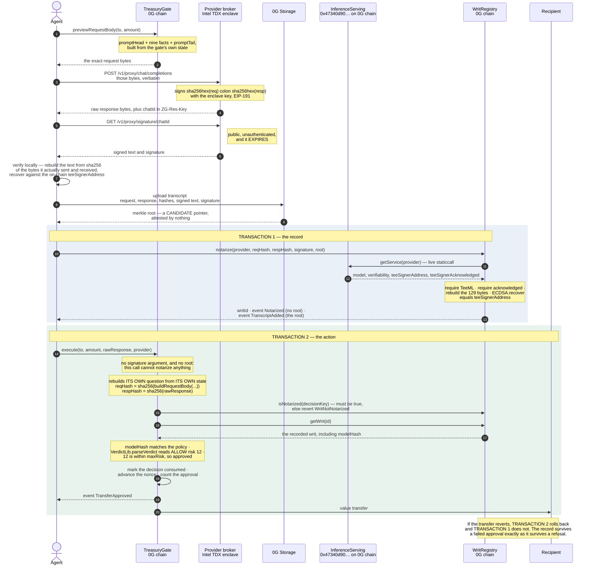

# Writ — technical reference

Writ verifies a 0G Compute TEE inference proof **inside a smart contract on 0G**, records it
permanently, and lets other contracts act on the verified decision. Because the TEE's signature
binds the request as well as the response, a contract that rebuilds its own question can prove the
proof answers *that* question. A prompt cannot be swapped. A refusal is a successful transaction
that records the refusal forever.

This document is the contract-by-contract reference plus the byte-level detail everything rests on.
For what is and is not claimed, read [`../CLAIMS.md`](../CLAIMS.md). For the real-versus-simulated
line, read [`../MOCKS.md`](../MOCKS.md).

Everything measured here was measured on 2026-08-26 with Foundry `forge 1.7.1`, `solc 0.8.24`,
optimizer on at 200 runs, and against 0G mainnet (chain 16661) over `https://evmrpc.0g.ai`.

**Nothing is deployed yet.** Every address in this document is either 0G's own or is written as
`<UNDEPLOYED — no address exists yet>`. There are no placeholder hex strings anywhere in this repo
that could be mistaken for a deployment.

---

## Contents

1. [The chain of custody](#1-the-chain-of-custody)
2. [The signed text: exact byte layouts](#2-the-signed-text-exact-byte-layouts)
3. [EIP-191 reconstruction on chain](#3-eip-191-reconstruction-on-chain)
4. [The reveal step](#4-the-reveal-step)
5. [The nine-fact question](#5-the-nine-fact-question)
6. [Contract reference](#6-contract-reference)
7. [Sequence diagrams](#7-sequence-diagrams)
8. [Measured gas](#8-measured-gas)
9. [What the proof reduces to](#9-what-the-proof-reduces-to)

---

## 1. The chain of custody

```
1. Policy on chain      A PolicyGate holds a prompt head, a prompt tail, an allowed model hash,
                        an optional allowed provider, and a risk ceiling. Fixed at construction.
                        The head and the hash are derived from ONE model name — see §6.4.

2. Question built       The CONTRACT assembles the request body: promptHead ‖ params ‖ promptTail,
                        where params are derived from the contract's own state and the action
                        proposed. The client never composes the question — it reads the bytes out
                        of the contract and posts those exact bytes.

3. Inference            Non-streaming POST to <endpoint>/chat/completions. The raw response text
                        is captured before any parsing.

4. Proof claimed        GET <endpoint>/signature/{chatId}?model=… — public, unauthenticated, and
                        it expires. Claimed immediately, before anything slow happens.

5. Archive              Transcript uploaded to 0G Storage; the merkle root is published on chain
                        as a CANDIDATE pointer. It is not attested by anything — see §6.3.

6. Notarize             WritRegistry reads 0G's live InferenceServing on the same chain, rebuilds
                        the signed text from the two hashes, recovers the signer, and compares it
                        to the provider's registered teeSignerAddress. Recorded forever.

7. Settle               The gate rebuilds its own question from its own state, hashes it with the
                        sha256 precompile, and requires the writ to ALREADY EXIST under exactly
                        that hash. Then it parses the verdict out of the revealed response bytes
                        and acts.
```

**Steps 6 and 7 are separate transactions, and that is enforced on chain, not merely recommended.**
`PolicyGate._consume` reverts `WritNotNotarized(bytes32)` if the writ is not already on the
registry; it has no signature argument and cannot notarize. A gate that notarized inline would put
the permanent record and the guarded action in one transaction, so an approval whose payout
reverted would roll the record back with it — refusals would be permanent and failed approvals
would leave nothing, which falsifies the whole point. See
[§6.4 `PolicyGate`](#64-policygate) and `contracts/test/AgentTreasury.t.sol::test_aRevertingRecipientLeavesTheNotarizationIntact`.

---

## 2. The signed text: exact byte layouts

The 0G provider broker signs a *text*, not a struct. Every guarantee Writ offers depends on
rebuilding that text byte-for-byte, so this section is exact.

All source paths below are in `0gfoundation/0g-serving-broker` at commit
`3a2f1a5aad241c436ad5fc1e08fe38ae3d0d2a43` (2026-08-26) unless stated otherwise. `sha256Hex` is
defined at `api/inference/internal/ctrl/signing.go:49-52` as
`hex.EncodeToString(sha256.Sum256(b))` — Go's lowercase, zero-padded, unprefixed hex.
`WritLib.hex64` reproduces exactly that.

Every format is signed the same way (`signing.go:107`, `:155`, `:228`, `:78`):

```go
sig, err := c.teeService.SignHash(accounts.TextHash([]byte(text)))
if sig[64] == 0 || sig[64] == 1 { sig[64] += 27 }
```

`accounts.TextHash` is EIP-191 personal-sign. The `v` normalisation means the signature is always
65 bytes with `v ∈ {27, 28}`, which is what OpenZeppelin's `ECDSA.recover` accepts.

### 2.1 Format A — plaintext chat proof · **SUPPORTED**

Produced by `signChatWithKey`, `api/inference/internal/ctrl/signing.go:98-127`:

```go
text := fmt.Sprintf("%s:%s", sha256Hex(reqBody), sha256Hex(respData))
```

Its own doc comment says which services use it, verbatim:

> Used by chatbot, video, speech-to-text, and the fallback path of text-to-image / image-editing
> when b64 images cannot be extracted.

**Exactly 129 bytes:**

| Offset | Length | Content |
|---:|---:|---|
| 0 | 64 | `sha256(requestBody)` — lowercase hex, no `0x` |
| 64 | 1 | `0x3a` (`:`) |
| 65 | 64 | `sha256(responseBody)` — lowercase hex, no `0x` |

Rebuilt on chain by `WritLib.signedText`. Asserted byte-for-byte, including the 129, in
`contracts/test/WritLib.t.sol::test_signedTextIs129BytesAndMatchesBroker`.

Neither hash can smuggle the delimiter, because both are provably 64 characters drawn from
`[0-9a-f]`. The two-field split is unambiguous.

### 2.2 Format B — centralized routing proof · **SUPPORTED**

Produced by `signCentralizedRoutingProof`, `signing.go:176-252`, which delegates the assembly to
`FormatRoutingProofText` in `api/common/tee/tls.go:99-106`:

```go
return fmt.Sprintf("%s:%s:%s:%s:%s",
    requestSha256, responseSha256, providerType, providerIdentity, tlsCertFingerprint)
```

**Variable length, `196 + |providerType| + |providerIdentity|` bytes:**

| Offset | Length | Content |
|---:|---:|---|
| 0 | 64 | `sha256(requestBody)` hex |
| 64 | 1 | `:` |
| 65 | 64 | `sha256(responseBody)` hex |
| 129 | 1 | `:` |
| 130 | `T` | `providerType` — free text, in practice `"centralized"` |
| 130+`T` | 1 | `:` |
| 131+`T` | `I` | `providerIdentity` — free text; live values include `aliyun`, `openrouter`, `minimax`, `moonshot`, `tencent`, `bytedance`, `zhipu` |
| 131+`T`+`I` | 1 | `:` |
| 132+`T`+`I` | 64 | `tlsCertFingerprint` — 32 bytes, lowercase hex |

With `providerType = "centralized"` (11) and `providerIdentity = "openrouter"` (10) that is
**217 bytes**, asserted in `contracts/test/WritLib.t.sol::test_routingProofTextMatchesBrokerFormat`.

This binds strictly more than Format A: the TLS certificate fingerprint names the upstream that
actually served the request. The chat format attests nothing about that.

The fingerprint is normalised by `NormalizeCertFingerprint` (`api/common/tee/tls.go:83-97`):
trimmed, lowercased, and required to be exactly `sha256.Size*2 = 64` hex characters. The broker
**refuses to sign** a routing proof without a well-formed fingerprint (`signing.go:206-217`), so
this field, like the two hashes, provably cannot contain a `:`.

The two label fields *can*. `("x", "y:z")` and `("x:y", "z")` produce identical signed bytes, which
would let one valid signature be recorded under two different attributions. The signature is not
weakened by this — a wrong split simply fails recovery — but the *record* would be. So
`WritRegistry._requireLabel` rejects an empty label, a label over 32 bytes, and any label
containing `:`. `sdk/src/hashes.ts::assertRoutingFields` mirrors it so the failure is a readable
error rather than a revert after gas is spent.

Recovery is `WritLib.recoverRoutingProofSigner`. Because the text is variable length, the EIP-191
prefix must carry the real decimal length — see [§3](#3-eip-191-reconstruction-on-chain).

### 2.3 Format C — image response · **NOT SUPPORTED**

Produced by `signImageResponse`, `signing.go:129-174`:

```go
text := sha256Hex(reqBody) + ":" + strings.Join(imgHashes, ",")
```

**Length `64 + 65n` for `n` images:**

| Offset | Length | Content |
|---:|---:|---|
| 0 | 64 | `sha256(originalClientRequestBody)` hex |
| 64 | 1 | `:` |
| 65 | 64 | `sha256(img₀)` hex |
| 129 | 1 | `,` — present only when `n > 1` |
| 130 | 64 | `sha256(img₁)` hex |
| … | | repeating `,` + 64 |

**Writ does not support this format, and does not verify it.** The comma-joined list needs its own
binding rules — what a "response" even means when the attested artifact is a set of image blobs is
a question we have not answered, and a half-implementation would verify signatures over a text
whose meaning we had not pinned down.

**A caveat we volunteer, because it is real:** for `n = 1`,
`strings.Join([h], ",")` is just `h`, so the text is `sha256(req):sha256(img₀)` — **129 bytes, and
byte-shape identical to Format A.** A single-image proof is therefore indistinguishable from a chat
proof, and both `WritLib.signedText` and `sdk/src/hashes.ts::parseSignedText` would treat it as
one. Both code comments that used to claim the image format "is rejected rather than mistaken for a
chat proof" have since been corrected to say exactly this — `WritLib`'s NatSpec and
`sdk/src/hashes.ts::parseSignedText`'s doc comment. Neither the contract nor the SDK now claims a
discrimination it does not perform. See `CLAIMS.md` — this is listed there, not buried here.

We judge the practical consequence small: a writ recorded that way would still say something true
(the TEE did sign that pair), and a `PolicyGate` could only consume it if the raw image bytes both
hashed to the pinned `respHash` and contained a well-formed `"content":"ALLOW:<n>"` marker while
the request bytes were simultaneously the gate's own chat-completions body. It remains a defect in
the format discrimination and it is stated as one.

### 2.4 Formats D, E, F — scheme-tagged E2EE proofs · **NOT SUPPORTED**

The current broker signs a fourth family that this project's earlier notes did not name. It is
produced by `signChatE2EE` (`signing.go:65-96`) whenever the client sealed its request, and its
text is assembled in a different repository — `0gfoundation/0g-pc-e2ee`,
`protocol/proof/proof.go`, read at commit `97bf7944f182f4bc286b0a57fd5389f8225f4d10`:

```go
// proof.go:168-170
func formatText(scheme string, reqH, respH [32]byte) string {
    return scheme + ":" + hex.EncodeToString(reqH[:]) + ":" + hex.EncodeToString(respH[:])
}
```

| Scheme constant | Tag | Total bytes |
|---|---|---:|
| `SchemeE2EECiphertext` | `zg-sig-v1/e2ee-ct` | 147 |
| `SchemeE2EECiphertextStream` | `zg-sig-v1/e2ee-ct-stream` | 154 |
| `SchemePlaintext` | `zg-sig-v1/plain` | 145 |

Layout is `<scheme>:<64 hex>:<64 hex>`. The hashes are **not** `sha256` of the wire body. For the
non-stream E2EE scheme each half is `BindingHash(aad, ct) = sha256(sha256(aad) ‖ sha256(ct))` over
the sealed envelope's on-wire artifacts (`proof.go:53-59`). For the stream scheme the response half
is `sha256(H(f₀) ‖ … ‖ H(f_{n-1}))` over the sealed frames in send order
(`StreamBinder.Text`, `proof.go:161-165`). `SchemePlaintext` is declared for the contract's
completeness and, per its own comment, is not verified in that module.

**These fail closed rather than being mistaken for anything.** They split into three
`:`-separated fields; `sdk/src/hashes.ts::parseSignedText` accepts only two or five and throws
`unsupported signed text format (3 ':'-separated fields)`. On chain there is no entry point that
would accept them at all. Writ never seals a request, so its own runs never produce one — but a
third party's archived proof might, and Writ will refuse it rather than guess.

### 2.5 Which format a live provider actually produces

The broker's dispatch is `signChatResponse`, `api/inference/internal/ctrl/chatbot.go:561-607`, in
this order:

```
1. client sealed the request        -> signChatE2EE            (Format D/E — unsupported)
2. else Service.IsCentralized()     -> signCentralizedRoutingProof (Format B — supported)
3. else !Service.TargetSeparated    -> signChatWithKey         (Format A — supported)
4. else                             -> NO SIGNATURE AT ALL     (the remote TEE signs)
```

Case 2 is non-fatal on failure: the broker logs and returns, so the client gets a `404` from
`/v1/proxy/signature/{chatID}` rather than a proof with no TLS evidence. Case 4 is why
`TargetSeparated` matters — such a provider's broker signs nothing.

The image and async paths (`async.go:469-497`, `image_editing.go:248-263`) dispatch the same way,
substituting `signImageResponse` for `signChatWithKey` when b64 images can be extracted.

`ProviderType` and `TargetSeparated` are published in the registry's `additionalInfo` JSON
(`api/inference/internal/contract/service.go:64-87`), so the format a provider will produce is
readable on chain before you talk to it. Read live from mainnet `InferenceServing` on 2026-08-26 —
24 registered services:

| Class | Count | Signed text | Writ |
|---|---:|---|---|
| Acknowledged `TeeML`, `ProviderType: centralized` | 13 | Format B | verifiable |
| Acknowledged `TeeML`, decentralized, `TargetSeparated: false` | 6 | Format A (Format C for `text-to-image`) | verifiable, except the one image service |
| Acknowledged `TeeML`, decentralized, `TargetSeparated: true` | 0 | none produced by the broker | n/a today |
| `TeeML` but **not acknowledged** | 3 | — | rejected: `SignerNotAcknowledged` |
| `verifiability: "standard"` (`0x1F444c8A…`, `0xd3f02c1a…`) | 2 | none | rejected: `NotTeeVerifiable` |

Of the 19 acknowledged TeeML services, 18 produce a signed text Writ verifies. The exception is
`z-image-turbo` (`0xE29a72c7…`, `serviceType: text-to-image`), which is the only live service that
reaches Format C. Note that even it falls back to Format A when b64 images cannot be extracted.

`0x44ba5021…` is the only live service with a non-empty `TargetTeeAddress`, and it is not
acknowledged. Should 0G ever acknowledge a separated-TEE provider, `WritRegistry` would compare the
recovered address against `teeSignerAddress` and revert `BadSignature` — it fails closed rather
than accepting the wrong signer.

---

## 3. EIP-191 reconstruction on chain

`WritLib.recoverSigner` rebuilds the text from two `bytes32` and recovers:

```solidity
function hex64(bytes32 value) internal pure returns (bytes memory out) {
    out = new bytes(64);
    for (uint256 i = 0; i < 32; i++) {
        uint8 b = uint8(value[i]);
        out[i * 2]     = HEX_DIGITS[b >> 4];
        out[i * 2 + 1] = HEX_DIGITS[b & 0x0f];
    }
}

function signedText(bytes32 reqHash, bytes32 respHash) internal pure returns (bytes memory) {
    return abi.encodePacked(hex64(reqHash), ":", hex64(respHash));
}

function recoverSigner(bytes32 reqHash, bytes32 respHash, bytes memory signature)
    internal pure returns (address)
{
    bytes32 digest = MessageHashUtils.toEthSignedMessageHash(signedText(reqHash, respHash));
    return ECDSA.recover(digest, signature);
}
```

`HEX_DIGITS` is `"0123456789abcdef"` — lowercase, matching Go. Uppercase hex would recover a
different address and every proof would fail.

### Why the length prefix matters

EIP-191 personal-sign hashes `"\x19Ethereum Signed Message:\n" ‖ decimal(len) ‖ message`. The
length is **decimal ASCII**, not a fixed field. For Format A it is always the three bytes `129`,
which is tempting to hardcode. For Format B it is `196 + |T| + |I|` — a number that changes with
the provider's labels.

`MessageHashUtils.toEthSignedMessageHash(bytes memory)` derives the prefix from the actual byte
length via `Strings.toString`, so both formats are handled by the same code path with no special
cases. `contracts/test/WritLib.t.sol::test_routingProofPrefixCarriesTheDecimalLength` pins this
directly: the same signature recovers the signer under the `…\n217` prefix and does not under
`…\n129`.

This is the one place a hand-rolled prefix would have been silently wrong, and it is the reason
Writ uses OpenZeppelin's helper rather than assembling the prefix itself.

### Cross-format non-interchangeability

`test_theTwoSignedTextFormatsDoNotCrossVerify` asserts both directions: a routing signature does
not recover under `recoverSigner`, and a chat signature does not recover under
`recoverRoutingProofSigner`. Their writ identifiers are domain-separated too — see
[§6.3](#63-writregistry).

### Signature malleability

`ECDSA.recover` rejects `s` above `secp256k1n/2` with `ECDSAInvalidSignatureS` and rejects any `v`
outside `{27, 28}` with `ECDSAInvalidSignature`. The broker normalises `v` at `signing.go:112-114`
and go-ethereum's signer produces canonical low-`s`, so real proofs satisfy both. Writ inherits
these checks rather than reimplementing them; a malleated copy of a valid signature reverts instead
of producing a second writ id for the same decision.

---

## 4. The reveal step

The signature covers *hashes*. To act on the decision a contract needs the *bytes*. The
re-binding is one opcode:

```solidity
reqHash  = sha256(buildRequestBody(policyId, params));   // rebuilt, not revealed
respHash = sha256(rawResponse);                          // revealed by the caller
```

`sha256` is the precompile at address `0x02`, so this is exact and cheap.

**The two sides are asymmetric, and the asymmetry is the whole point.**

- The **response** is genuinely revealed. The caller hands over `rawResponse` and the contract
  proves it is the bytes the TEE signed by hashing them. This is what lets `VerdictLib` read a
  verdict out of a body nobody can substitute.
- The **request** is *not* revealed. The contract builds it itself, from a policy fixed at
  construction and parameters derived from its own state. The caller never gets to say what the
  question was. That is why a swapped prompt cannot be laundered through the reveal:
  `PolicyGate._pin` computes `reqHash` from `buildRequestBody`, so the hash a proof must match is
  not the caller's to choose.

`contracts/test/WritLib.t.sol::test_sha256PrecompileBindsRawRequestBytes` and
`test_sha256PrecompileBindsRawResponseBytes` pin the precompile's agreement with the fixtures
generated by `script/gen-fixtures.mjs`, which reproduces the broker's Go path in JavaScript.

Off chain, the same re-derivation is performed from the archived transcript alone by
`mcp/src/rehydrate.ts::verifyArchivedTranscript`, which ignores every claim the transcript makes
about itself: it re-hashes the bytes, rebuilds the signed text from those hashes, and recovers the
signature against `InferenceServing.getService(provider).teeSignerAddress`. `signingAddress` in the
file is discarded.

**Which transcript?** Whichever candidate re-derives. A writ carries a list of claimed archive
pointers, not one authoritative root, so a consumer walks them in submission order and stops at the
first whose bytes hash to the writ's `reqHash` and `respHash`. If none does, the correct report is
**`unavailable` with a reason** — never a failure attributed to the writ, which was verified by
signature recovery independently of every pointer. See
[the transcript list](#the-transcript-list-candidates-not-facts).

---

## 5. The nine-fact question

`TreasuryGate.buildParams(to, amount)` renders nine facts. Seven are derived on chain at the moment
the question is built; only `recipient` and `amount` come from the caller, and those two *are* the
action being authorised.

```
recipient=<lowercase 0x hex address, 42 chars>
amount=<wei, decimal>
nonce=<decimal>
treasuryBalance=<wei, decimal>
amountPctOfBalance=<0-999, decimal>
priorApprovals=<decimal>
priorRefusals=<decimal>
recipientPriorPayments=<decimal>
recipientPriorTotal=<wei, decimal>
```

Fields are joined by a single space, `key=value`, in exactly that order.

### Worked example

A gate holding 10 0G, never used before, asked about 1 0G to `0x00000000000000000000000000000000000000d1`:

```
recipient=0x00000000000000000000000000000000000000d1 amount=1000000000000000000 nonce=0 treasuryBalance=10000000000000000000 amountPctOfBalance=10 priorApprovals=0 priorRefusals=0 recipientPriorPayments=0 recipientPriorTotal=0
```

`AgentTreasury` wraps that in this exact body — `promptHead ‖ params ‖ promptTail`:

```json
{"model":"0GM-1.0-35B-A3B","temperature":0,"messages":[{"role":"system","content":"You are a treasury risk gate. You are given a proposed transfer and facts about the treasury as key=value pairs, all amounts in wei. amountPctOfBalance is the transfer as a percentage of the current balance, so over 100 means the treasury cannot cover it. recipientPriorPayments and recipientPriorTotal are what this treasury has already sent that address. Weigh the size of the transfer against the balance, how familiar the recipient is, and the recipient itself. Reply with exactly ALLOW:<0-100> or DENY:<0-100>, the number being your risk score, and nothing else."},{"role":"user","content":"Approve this transfer? recipient=0x00000000000000000000000000000000000000d1 amount=1000000000000000000 nonce=0 treasuryBalance=10000000000000000000 amountPctOfBalance=10 priorApprovals=0 priorRefusals=0 recipientPriorPayments=0 recipientPriorTotal=0"}]}
```

Those are the bytes a client posts, unchanged, to `<endpoint>/chat/completions`. `sha256` of them
is the `reqHash` the gate will insist a proof pins.

### Two properties of that string

**There is no free-text field.** One lowercase hex address rendered by `Strings.toHexString`, and
eight decimal integers rendered by `Strings.toString`. Nothing a caller writes reaches the question
as prose, so there is nothing to inject into. `PolicyGate`'s NatSpec states the corresponding rule
for anyone deriving a new gate: `params` must be built only from typed values formatted as hex or
decimal, because passing caller-supplied strings through would be JSON injection into the pinned
question.

**The proof is bound to the treasury as it stood.** The balance, the decision counts, and the
recipient's payment history are all in the question. An approval obtained against one treasury
state does not settle against another. That is a guarantee and a cost, and both are stated in
`CLAIMS.md`.

### `amountPctOfBalance`

```solidity
function _percentOfBalance(uint256 amount, uint256 bal) private pure returns (uint256) {
    if (amount == 0) return 0;
    if (bal == 0) return PCT_CAP;              // 999
    uint256 pct = Math.mulDiv(amount, 100, bal);
    return pct > PCT_CAP ? PCT_CAP : pct;
}
```

Total by construction: an empty treasury reports the cap rather than dividing by zero, and
`Math.mulDiv` carries the 512-bit intermediate so a large amount cannot overflow the
multiplication. It is a floored integer capped at 999 — 25× and 1000× are the same number to the
model, and anything under 1% reports 0. `amount` and `treasuryBalance` are both in the question at
full precision, so nothing is lost, but a policy that needs to discriminate inside those ranges
cannot do it from this field alone.

Three of the nine facts — `nonce`, `priorApprovals`, `priorRefusals` — are handed to the model
without an explanation in the system prompt. The other six are explained. This is noted in
`CLAIMS.md` rather than defended here.

### Off-chain mirrors

- `mcp/src/question.ts` parses the nine facts back out of a request body with a pattern anchored at
  both ends, and mirrors `_percentOfBalance` including its cap and its zero cases. A drift between
  that file and the contract shows up as a parse that returns `null`, not as a silent
  misinterpretation.
- `mcp/src/verdict.ts` mirrors `VerdictLib.parseVerdict` byte for byte, so a tool can say what the
  gate will do before spending gas finding out.

---

## 6. Contract reference

Source lives in `contracts/src/`. Solidity `0.8.24` exactly. Dependencies:
`@openzeppelin/contracts` v5.7.0.

| Contract | Kind | Owner | Upgradeable |
|---|---|---|---|
| `WritLib` | library, `internal pure` only | — | no |
| `VerdictLib` | library, `internal pure` only | — | no |
| `PromptLib` | library, `internal pure` only | — | no |
| `WritRegistry` | contract | **none** | no |
| `PolicyGate` | abstract base | — | no |
| `TreasuryGate` | contract | `owner` holds only the recovery hatch | no |
| `AgentTreasury` | `TreasuryGate` with its policy baked in | as above | no |
| `PolicyGateFactory` | contract | **none** | no |

There is also `script/Deploy.s.sol`, which is not a deployed contract but is the only supported way
to bring the three up together — see [§6.9](#69-scriptdeployssol).

### 6.1 `WritLib`

**Responsibility.** Rebuild a broker-signed text from `bytes32` hashes and recover the secp256k1
signer. Stateless, no storage, no owner, no external functions. This is the piece worth reusing
independently of everything else.

**Interface** (all `internal pure`):

| Function | Returns |
|---|---|
| `hex64(bytes32 value)` | 64-byte lowercase hex, no `0x` |
| `signedText(bytes32 reqHash, bytes32 respHash)` | the 129-byte Format A text |
| `recoverSigner(bytes32 reqHash, bytes32 respHash, bytes memory signature)` | recovered address |
| `routingProofText(bytes32 reqHash, bytes32 respHash, string memory providerType, string memory providerIdentity, bytes32 tlsFingerprint)` | the Format B text |
| `recoverRoutingProofSigner(bytes32 reqHash, bytes32 respHash, string memory providerType, string memory providerIdentity, bytes32 tlsFingerprint, bytes memory signature)` | recovered address |

**Errors.** None of its own. It propagates OpenZeppelin's `ECDSAInvalidSignature`,
`ECDSAInvalidSignatureLength(uint256)` and `ECDSAInvalidSignatureS(bytes32)`.

**Contract for callers.** `recoverSigner` returns *an* address. It does not decide whether that
address is trustworthy. Comparing it against 0G's registry is the caller's job, and
`WritRegistry` is where that happens.

### 6.2 `VerdictLib`

**Responsibility.** Extract a strict verdict token from a raw chat-completions body. Deliberately
not a JSON parser: the policy constrains the model to answer with exactly `ALLOW:<0-100>` or
`DENY:<0-100>`, so a marker-anchored scan with a hard length cap is sufficient and total.

**Interface.** `parseVerdict(bytes memory body) internal pure returns (bool allowed, uint8 risk)`.

**Algorithm.**

1. Scan for the first occurrence of the 11 bytes `"content":"`. Not found → `MarkerNotFound`.
2. Read forward to the next `"`. More than 32 bytes without one → `VerdictTooLong`. End of body
   without one → `VerdictMalformed`.
3. The content must start with the literal `ALLOW:` or `DENY:` — uppercase, exact.
4. Everything after the colon must be 1–3 ASCII digits with a value ≤ 100.

Anything else reverts. `ALLOW:007` parses as risk 7; `allow:12`, `ALLOW: 12`, `ALLOW:12 (safe)`,
`ALLOW:101` and `ALLOW:` all revert. 13 cases in `contracts/test/VerdictLib.t.sol`.

**Errors.**

| Error | Trigger |
|---|---|
| `MarkerNotFound()` | the body is shorter than 11 bytes, or contains no `"content":"` anywhere |
| `VerdictTooLong()` | 32 bytes read past the marker without hitting a closing `"` |
| `VerdictMalformed()` | no closing `"` before end of body; or the content does not begin `ALLOW:`/`DENY:`; or a non-digit after the colon; or zero digits; or more than three digits; or a value above 100 |

**A malformed answer is not a refusal.** It reverts. A refusal is a claim the model made; a
malformed answer is an answer nobody can read, and reading it as "no" would be inventing a decision
the model did not make.

**Assumption we name.** The scan anchors on the *first* `"content":"` in the body. Every response
shape we have seen puts the completion first. A response that echoed an attacker-chosen short
string ahead of `choices` could steer the anchor. The response shape belongs to the TEE, not to the
agent a gate defends against, so this sits outside the threat model — but it is an assumption, and
`CLAIMS.md` lists it. Note also that `"reasoning_content":"` does not match, because the marker
requires a `"` immediately before `content`.

### 6.3 `WritRegistry`

**Responsibility.** The permanent public record. Verify a TEE proof against 0G's live
`InferenceServing` on the same chain and store it forever. Ownerless, non-upgradeable, no
allowlist, no privileged submitter. Validity is decided entirely by the signature and the official
registry.

**Constructor.** `constructor(address serving_)`. `serving` is `immutable`. On 0G mainnet it is
`0x47340d900bdFec2BD393c626E12ea0656F938d84` (chain 16661); on Galileo testnet
`0xa79F4c8311FF93C06b8CfB403690cc987c93F91E` (chain 16602). The **zero** address reverts
`ZeroServing()` — that is the one mistake worth catching here, because it is what a missing
environment variable produces and it would otherwise deploy a registry that fails silently on every
proof. **Nothing else is validated:** the constructor does not check that the address is a
contract, that it implements `getService`, or that it is 0G's. A registry deployed against a wrong
non-zero address would verify against the wrong authority and look entirely healthy doing it. The
defence is `script/Deploy.s.sol`, which reads a real service off the address before broadcasting,
plus reading `registry.serving()` after deployment. Do both.

**Storage.**

| Slot | Name | Type |
|---:|---|---|
| 0 | `_writs` | `mapping(bytes32 => Writ)` |
| 1 | `_routingProofs` | `mapping(bytes32 => RoutingProof)` |
| 2 | `_transcriptRoots` | `mapping(bytes32 => bytes32[])` |
| 3 | `_transcriptSubmitter` | `mapping(bytes32 => mapping(bytes32 => address))` |
| 4 | `_transcriptQuotaUsed` | `mapping(bytes32 => mapping(address => uint256))` |
| 5 | `writCount` | `uint256` |

```solidity
struct Writ {
    address provider;         // +0, offset 0  (20 bytes; the next field needs a whole slot)
    bytes32 modelHash;        // +1
    bytes32 reqHash;          // +2
    bytes32 respHash;         // +3
    uint64  notarizedAt;      // +4, offset 0  \ packed together: 8 + 20 = 28 bytes
    address notarizedBy;      // +4, offset 8  /
}

struct RoutingProof { string providerType; string providerIdentity; bytes32 tlsFingerprint; }
```

Five slots per writ, all written cold in one `notarize`, which is most of the cost in
[§8](#8-measured-gas).

**`Writ` deliberately has no `transcriptRoot` field, and the `Notarized` event carries none.** The
TEE signs the request and response hashes and nothing else; a root is a claim by whoever published
it. A field for one sitting beside four verified facts would invite a reader to treat it as a
fifth. Candidates live in `transcriptRoots`, where they are labelled as claims. See
[the transcript list](#the-transcript-list-candidates-not-facts) below.

The model **name** is stored only as `keccak256(bytes(model))` and emitted raw in the event, so
indexers get the string for free while storage stays one slot.

**External interface.**

| Function | Mutability | Notes |
|---|---|---|
| `serving()` | `view` | the `IInferenceServing` this registry trusts |
| `writCount()` | `view` | total writs recorded, both kinds |
| `writId(address provider, bytes32 reqHash, bytes32 respHash)` | `pure` | `keccak256(abi.encode(...))` |
| `routingWritId(address provider, bytes32 reqHash, bytes32 respHash, string providerType, string providerIdentity, bytes32 tlsFingerprint)` | `pure` | domain-tagged, see below |
| `isNotarized(bytes32 id)` | `view` | `_writs[id].notarizedAt != 0` |
| `isRoutingProof(bytes32 id)` | `view` | true iff a `RoutingProof` was stored under `id` |
| `getWrit(bytes32 id)` | `view` | reverts `NotNotarized` for an unknown id |
| `getRoutingProof(bytes32 id)` | `view` | reverts `NotARoutingProof` for a chat writ |
| `MAX_ROOTS_PER_SUBMITTER()` | `view` | `4` |
| `transcriptRoots(bytes32 id)` | `view` | every candidate pointer, in submission order |
| `transcriptRootCount(bytes32 id)` | `view` | how many candidates this writ carries |
| `transcriptRootAt(bytes32 id, uint256 index)` | `view` | `(bytes32 root, address submitter)`; reverts `TranscriptIndexOutOfRange` |
| `transcriptSubmitter(bytes32 id, bytes32 root)` | `view` | who published a candidate; zero if unlisted |
| `transcriptQuotaUsed(bytes32 id, address submitter)` | `view` | how much of the 4 this address has spent |
| `addTranscript(bytes32 id, bytes32 root)` | — | publish another candidate; permissionless |
| `notarize(address provider, bytes32 reqHash, bytes32 respHash, bytes calldata signature, bytes32 transcriptRoot)` | — | Format A. The root is optional (`bytes32(0)` lists nothing) and goes through `addTranscript`'s door |
| `notarizeRoutingProof(address provider, bytes32 reqHash, bytes32 respHash, string calldata providerType, string calldata providerIdentity, bytes32 tlsFingerprint, bytes calldata signature, bytes32 transcriptRoot)` | — | Format B, same treatment of the root |

**Events.**

```solidity
event Notarized(
    bytes32 indexed id, address indexed provider, bytes32 indexed modelHash,
    string model, bytes32 reqHash, bytes32 respHash, address notarizedBy
);
event RoutingProofNotarized(
    bytes32 indexed id, address indexed provider,
    string providerType, string providerIdentity, bytes32 tlsFingerprint
);
event TranscriptAdded(bytes32 indexed id, bytes32 indexed root, address indexed submitter);
```

`Notarized` carries **no** transcript root: a root is a claim, and it gets its own event so a claim
is never delivered inside the record of a verified fact. `TranscriptAdded` is emitted for the root
supplied at notarization too, so following that one event gives an indexer every candidate in
submission order. Both `Notarized` and `RoutingProofNotarized` are emitted for a routing writ.
There is no on-chain enumeration of writ ids — `writCount` is a counter, not an index — so an
indexer must read `Notarized`.

**What `notarize` does, in order.**

1. `id = writId(provider, reqHash, respHash)`.
2. Revert `AlreadyNotarized(id)` if the record exists.
3. `svc = serving.getService(provider)` — a live read on every call, never a cached copy. The live
   contract reverts `ServiceNotExist(provider)` for an address it has never seen, and that revert
   propagates.
4. Revert `SignerNotAcknowledged(provider)` unless `svc.teeSignerAcknowledged`.
5. Revert `NotTeeVerifiable(provider, svc.verifiability)` unless
   `keccak256(bytes(svc.verifiability)) == keccak256("TeeML")`.
6. Revert `BadSignature(recovered, expected)` unless
   `WritLib.recoverSigner(reqHash, respHash, signature) == svc.teeSignerAddress`.
7. Store the record, `++writCount`, emit `Notarized`.
8. If `transcriptRoot != bytes32(0)`, append it through the same private `_addTranscript` a later
   `addTranscript` call uses — attributed to `msg.sender`, against their quota, and emitting
   `TranscriptAdded`. Being first to record the proof buys no standing over the pointer.

`notarizeRoutingProof` validates both labels first (`_requireLabel`), computes the domain-tagged
id, then follows the identical checks with `recoverRoutingProofSigner`, stores the `RoutingProof`,
and emits both events.

#### The transcript list: candidates, not facts

`addTranscript(id, root)` is permissionless, and it has to be. `notarize` is permissionless and
records are immutable, so a single stored root would mean **whoever notarized first fixed the
archive pointer forever** — and because the signature endpoint is public and unauthenticated, that
can be a stranger who learned a chat id, notarized with a junk root, and left the real archivist
with nowhere to put the true one. Appending makes a wrong first root noise rather than damage.

Three rules, all O(1) because the list they touch is unbounded and a scan would itself be
griefable:

- `bytes32(0)` is not a pointer, it is the absence of one. `TranscriptRootEmpty()`.
- A root already listed on this writ is rejected — `TranscriptAlreadyListed(root)` — so a griefer
  cannot pad the list with one value. The submitter mapping being non-zero doubles as "already
  listed".
- Each **address** may publish at most `MAX_ROOTS_PER_SUBMITTER = 4` per writ.
  `TranscriptQuotaUsed(submitter, quota)`. A rejected call spends no quota.

**The quota is per submitter, not a cap on the list, and that choice is the whole defence.** A
global cap plus permissionless writes cannot both be safe: a griefer spends the entire list on
distinct junk roots and the real archivist is locked out forever — which is the front-running this
mechanism exists to defeat, only worse. With a per-address quota a griefer exhausts nothing but
their own, and every honest publisher always has room.
`test_aGrieferCannotDenyTheRealArchivistASlot` and `test_aFrontRunnersJunkRootDoesNotShutOutTheRealOne`
pin both halves.

**The cost is real and stated in [§6.3's limitations](#deliberate-non-checks-stated-plainly): the
list is unbounded by design.** One attacker with N addresses can publish 4N candidates. Nobody is
denied a slot — that was the actual attack — but `transcriptRoots(id)` can be grown until loading
it whole is expensive. That is exactly why `transcriptRootCount` and `transcriptRootAt` exist: a
caller that cannot bound its own gas walks the list instead of loading it. Bounding the list at all
reintroduces the lockout.

**How a reader uses it.** Try candidates in submission order; fetch the transcript each points at;
check that its request and response bytes `sha256` to the writ's `reqHash` and `respHash`; stop at
the first that re-derives. A candidate that fails is somebody's junk and says nothing about the
writ — the writ was verified by signature recovery against 0G's registered TEE signer,
independently of every pointer. `transcriptSubmitter` says whose claim a failed candidate was,
which is attribution, not endorsement.

**`unavailable` is not `fail`, and the distinction is load-bearing.** A candidate that does not
re-derive is a failed claim by whoever published it, not evidence against the writ. Grading it as a
failure is precisely the hole a front-runner would drive through: publish junk first and a sound
writ *reads as broken*. So a consumer that exhausts every candidate without one verifying must
report **`unavailable`, with a reason** — never a pass, and never a fallback to some weaker check.
The archive is a convenience for reconstructing the bytes; it is not, and must never become, part
of the trust chain.

**Domain separation.** `routingWritId` hashes
`keccak256("writ.routingProof.v1")` alongside the provider, both hashes, `keccak256` of each label
and the fingerprint. It is a longer preimage under a distinct tag, so a routing writ and a chat
writ over the same request and response are two different records. They *should* be: they attest
different things, and the routing proof names an upstream the chat proof says nothing about.
`test_routingWritIdDoesNotCollideWithPlainWritId` pins it.

**Full error table.**

| Error | Trigger |
|---|---|
| `ZeroServing()` | `constructor(address(0))` |
| `AlreadyNotarized(bytes32 id)` | this exact proof is already recorded. Re-notarizing is a loud failure, not a silent no-op — callers that only need the record to exist check `isNotarized` first |
| `SignerNotAcknowledged(address provider)` | `svc.teeSignerAcknowledged == false`. Three live mainnet TeeML services are in this state today |
| `NotTeeVerifiable(address provider, string verifiability)` | `svc.verifiability != "TeeML"`. This is what rejects the two live services 0G serves with `verifiability: "standard"` and no TEE (`0x1F444c8A…`, `0xd3f02c1a…`) |
| `BadSignature(address recovered, address expected)` | the recovered address is not the provider's registered `teeSignerAddress`. Covers a forged signature, a tampered request hash, a tampered response hash, and a proof in the wrong format |
| `NotNotarized(bytes32 id)` | `getWrit` on an id that was never recorded, or `addTranscript` for a writ that does not exist |
| `NotARoutingProof(bytes32 id)` | `getRoutingProof` on a chat writ |
| `RoutingFieldEmpty()` | `providerType` or `providerIdentity` is the empty string |
| `RoutingFieldTooLong(uint256 length)` | either label exceeds `MAX_ROUTING_FIELD` (32 bytes) |
| `RoutingFieldHasDelimiter()` | either label contains `:` |
| `TranscriptRootEmpty()` | `addTranscript` with `bytes32(0)`. `notarize` treats a zero root as "no pointer" and lists nothing instead of reverting |
| `TranscriptAlreadyListed(bytes32 root)` | this root is already a candidate on this writ, from any submitter |
| `TranscriptQuotaUsed(address submitter, uint256 quota)` | this address has already published `MAX_ROOTS_PER_SUBMITTER` candidates for this writ |
| `TranscriptIndexOutOfRange(uint256 index, uint256 length)` | `transcriptRootAt` past the end |
| `IInferenceServing.ServiceNotExist(address provider)` | raised by 0G's own contract and propagated: the provider has never registered a service |
| `ECDSAInvalidSignature()` / `ECDSAInvalidSignatureLength(uint256)` / `ECDSAInvalidSignatureS(bytes32)` | propagated from `ECDSA.recover` for a structurally invalid signature |

<a id="deliberate-non-checks-stated-plainly"></a>

**Deliberate non-checks, stated plainly.**

- **A transcript root is not verified and is not covered by the TEE signature.** It is an opaque
  `bytes32` some address published, and this contract has no way to check one. It is kept out of
  `Writ` and out of `Notarized` for exactly that reason. See `CLAIMS.md`.
- **The transcript list is unbounded, by design.** The per-submitter quota trades a lockout for
  growth. One attacker with N addresses can publish 4N candidates, so `transcriptRoots(id)` can be
  grown until loading it whole is expensive — walk it with `transcriptRootCount` and
  `transcriptRootAt` instead. Bounding the list at all reintroduces the lockout that the quota
  exists to prevent, which is the worse failure: unbounded reads cost gas, a permanent lockout
  costs the archive.
- **`additionalInfo` is not parsed.** The signature already binds `providerType` and
  `providerIdentity`, so cross-checking them against the service's JSON on chain would add attack
  surface for no security gain.
- **The model name is not attested by the TEE.** It is read from the registry at notarization time.
  See [§9](#9-what-the-proof-reduces-to).

### 6.4 `PolicyGate`

**Responsibility.** Abstract base that gates an action behind a TEE-attested verdict. It is where
the question is pinned and where a verdict is spent.

**Constructor.** `constructor(WritRegistry registry_)`. `registry` is `immutable` and public.

**Storage.**

| Slot | Name | Type |
|---:|---|---|
| 0 | `_policies` | `mapping(uint256 => Policy)`, `internal` |
| 1 | `consumed` | `mapping(bytes32 => bool)`, `public` |

`ReentrancyGuard`, where a derived contract uses it, keeps its flag in ERC-7201 namespaced storage
(OpenZeppelin 5.7.0) and takes no numbered slot.

```solidity
struct Policy {
    bytes   promptHead;
    bytes   promptTail;
    bytes32 allowedModelHash;
    address allowedProvider;   // address(0) = any acknowledged TeeML provider
    uint8   maxRisk;
}

enum Refusal { None, Model, Policy }

struct Decision { bytes32 id; bool approved; uint8 risk; Refusal refusedBy; }
```

`Decision` is a struct rather than a tuple for two reasons: four return values put
`_consumeRoutingProof` over the stack limit, and a struct lets a field be added later without
silently changing what an existing destructuring binds.

**`allowedModelHash` is still a hash in the `Policy` struct, but nothing may set it independently
any more.** Everything that builds a gate — `PolicyGateFactory` and `AgentTreasury` — takes a model
*name*, writes `{"model":"<name>",` into `promptHead` from it, and derives `allowedModelHash` from
that same string. `PolicyGate` itself never reads the prompt, so a gate whose two halves disagreed
would ask about one model and accept an answer from another with every check passing. See
[§6.8 `PromptLib`](#68-promptlib).

**External / public interface.**

| Function | Mutability | Notes |
|---|---|---|
| `registry()` | `view` | immutable |
| `consumed(bytes32)` | `view` | keyed by `decisionKey`, **not** by the writ id the registry recorded |
| `getPolicy(uint256 policyId)` | `view` | returns the whole `Policy` including both prompt halves |
| `buildRequestBody(uint256 policyId, bytes memory params)` | `view` | `promptHead ‖ params ‖ promptTail` |
| `decisionKey(address provider, bytes32 reqHash, bytes32 respHash)` | `view` | `registry.writId(...)` |

**Internal interface.**

| Function | Notes |
|---|---|
| `_setPolicy(uint256 policyId, Policy memory p)` | called only from a constructor in this codebase |
| `_consume(uint256 policyId, bytes memory params, bytes memory rawResponse, address provider)` | Format A path |
| `_consumeRoutingProof(uint256 policyId, bytes memory params, bytes memory rawResponse, address provider, WritRegistry.RoutingProof calldata routing)` | Format B path |

**Neither takes a signature, and neither can notarize.** That is the shape of the guarantee, not a
convenience: see [below](#the-writ-must-already-exist).

**`buildRequestBody` is the single source of truth for the question.** Clients call it and post the
returned bytes verbatim. They must never rebuild the body themselves — that is what makes
client/contract byte-drift structurally impossible rather than merely tested for.

**What `_consume` does, in order.**

1. `_pin`: revert `UnknownPolicy(policyId)` if `promptHead` is empty; revert
   `ProviderNotAllowed(got, want)` if the policy names a provider and this is not it; compute
   `reqHash = sha256(buildRequestBody(policyId, params))` and `respHash = sha256(rawResponse)`.
2. `id = decisionKey(provider, reqHash, respHash)`; revert `WritAlreadyConsumed(id)` if spent.
3. Revert `WritNotNotarized(id)` if `!registry.isNotarized(id)`. The proof has to be on the
   registry already, in an earlier transaction.
4. `_decide`: read the writ back with `registry.getWrit(id)`, revert `ModelNotAllowed(got, want)`
   if `w.modelHash` is not the policy's, parse the verdict (reverting on malformed), mark
   `consumed[decision] = true`, and return a `Decision`.

`_consumeRoutingProof` is identical except that it looks the record up under `routingWritId` while
the decision is still spent under `decisionKey`.

<a id="the-writ-must-already-exist"></a>

**The writ must already exist, and that ordering is structural.** A gate that notarized inline
would put the permanent record and the guarded action in one transaction. An approval whose payout
reverted would then roll the record back with it — so refusals would be permanent and *failed
approvals would leave nothing*, which is the exact asymmetry that falsifies "every decision is
recorded forever". Notarizing separately makes every decision — approved, refused, or
approved-but-unpayable — equally permanent, and it is why `_consume` has no signature argument to
notarize with. `AgentTreasury.t.sol::test_aRevertingRecipientLeavesTheNotarizationIntact` pins it:
the settlement rolls back, the writ and its transcript candidate do not, and the decision is not
marked consumed.

Consuming does not require having been the notarizer. Notarizing is a public good and someone else
may already have done it — `PolicyGate.t.sol::test_consumesAProofSomeoneElseNotarized`.

**Why the decision key is not the writ id.** A provider, a question and an answer make **one**
decision, and the same decision can arrive proved in either format. Those are two distinct writs in
the registry — both deserve to be recorded — but spending one must spend the other, or one verdict
would authorise two actions. `decisionKey` deliberately coincides with the chat writ id, because
that identifier already names exactly those three things.

`test_aRoutingProofSpendsTheChatDecisionToo`, `test_aChatProofSpendsTheRoutingDecisionToo` and
`test_aRefusalSpendsTheDecisionAcrossFormats` pin all three directions.

**Fail-closed, precisely.** A failure to *verify* reverts: the caller has not shown a decision at
all. A *verified refusal* returns `approved == false` instead, so the notarization survives and the
record is permanent. Fail-closed means the guarded action does not happen — not that the
transaction disappears.

**`refusedBy` names who said no.** `Refusal.Model` is the model answering `DENY`. `Refusal.Policy`
is the model answering `ALLOW` at a risk above this policy's ceiling. Both are final and both mean
no funds moved, but they mean different things and a reader deserves to be told which happened.
`Decision.approved` and `Decision.refusedBy` always agree; `test_approvedAgreesWithTheRefusalReason`
pins that.

**Error table.**

| Error | Trigger |
|---|---|
| `UnknownPolicy(uint256 policyId)` | `_policies[policyId].promptHead.length == 0`, from `buildRequestBody` or `_pin` |
| `ProviderNotAllowed(address got, address want)` | policy names a specific provider and the proof is from a different one |
| `ModelNotAllowed(bytes32 got, bytes32 want)` | the notarized writ's `modelHash` is not the policy's `allowedModelHash` |
| `WritAlreadyConsumed(bytes32 id)` | this decision has already been spent under `decisionKey`, in either format |
| `WritNotNotarized(bytes32 id)` | the proof is not on the registry. Notarize it first, in its own transaction |
| plus everything `WritRegistry` and `VerdictLib` can raise | propagated |

<a id="what-the-gate-checks-and-when"></a>

**What the gate checks, and when.** `PolicyGate` reads a record; it does not re-verify one. The TEE
signature, the provider's `TeeML` verifiability and 0G's acknowledgement of its signer are all
checked **once**, by `WritRegistry`, at the moment the proof is recorded. They are not read again
here, and there is no signature argument to read them against.

**That is the design, not a shortcut.** A permanent record is a statement about a moment. Consuming
a writ deliberately does not recheck the provider's live standing, because a permanent record means
the check happened once, at recording time — re-deriving it later would mean a writ's meaning
changed with the registry's later state. A proof recorded while 0G vouched for its provider stays a
proof of what that provider signed, whatever 0G says afterwards.

So read the model check for what it is: the gate enforces that the recorded writ names this
policy's provider and model and that its answer obeys the verdict grammar. It does **not** enforce
that 0G still acknowledges that provider today.
`PolicyGate.t.sol::test_consumingDoesNotRecheckTheProvidersLiveStanding` pins the behaviour
directly — the provider is downgraded to `verifiability: "standard"` and unacknowledged *after*
notarization, and the writ still consumes.

### 6.5 `TreasuryGate`

**Responsibility.** A treasury an autonomous agent operates but cannot drain. Funds move only
against a TEE-attested `ALLOW` answering this contract's own question about this exact recipient,
amount and nonce — and about the treasury as it actually stood.

**Inheritance.** `TreasuryGate is PolicyGate, ReentrancyGuard`.

**Constructor.** `constructor(WritRegistry registry_, address agent_, address owner_, Policy memory policy)`.
`agent` and `owner` are `immutable`. The policy is copied into storage under `POLICY_ID = 1` and
there is no setter, so **what the gate asks is fixed the moment it exists, and neither the agent nor
the policy can ever be changed.**

**Storage.**

| Slot | Offset | Name | Type |
|---:|---:|---|---|
| 0 | 0 | `_policies` | inherited |
| 1 | 0 | `consumed` | inherited |
| 2 | 0 | `nonce` | `uint256` |
| 3 | 0 | `lastAttestationAt` | `uint64` |
| 3 | 8 | `approvedCount` | `uint96` |
| 3 | 20 | `refusedCount` | `uint96` |
| 4 | 0 | `recipientHistory` | `mapping(address => RecipientHistory)` |

Slot 3 is exactly full at 64 + 96 + 96 = 256 bits, so settling a decision writes one slot.
`RecipientHistory` is `{ uint64 payments; uint192 total; }` — also one slot, because both fields
are facts the pinned question reports.

**Constants.** `POLICY_ID = 1`, `RECOVERY_DELAY = 30 days`, `PCT_CAP = 999` (private).

**External interface.**

| Function | Mutability | Notes |
|---|---|---|
| `agent()`, `owner()`, `nonce()`, `approvedCount()`, `refusedCount()`, `lastAttestationAt()` | `view` | |
| `recipientHistory(address)` | `view` | `(uint64 payments, uint192 total)` |
| `POLICY_ID()`, `RECOVERY_DELAY()` | `view` | constant getters; solc marks them `view`, not `pure` |
| `recoveryAvailableAt()` | `view` | `lastAttestationAt + RECOVERY_DELAY` |
| `buildParams(address to, uint256 amount)` | `view virtual` | the nine facts |
| `previewRequestBody(address to, uint256 amount)` | `view` | the exact bytes to post |
| `execute(address to, uint256 amount, bytes calldata rawResponse, address provider)` | `nonReentrant` | Format A |
| `executeRoutingProof(address to, uint256 amount, bytes calldata rawResponse, address provider, WritRegistry.RoutingProof calldata routing)` | `nonReentrant` | Format B |
| `recover(address to)` | `nonReentrant` | owner-only, timelocked |
| `receive()` | `payable` | anyone may fund the treasury |

**Neither entry point takes a signature or a transcript root, and neither notarizes.** The proof
must already be on the registry, put there in an earlier transaction — otherwise the call reverts
`WritNotNotarized(id)`. Those two trailing arguments were removed when notarization left the settle
path; a caller still passing them is calling a function that no longer exists.

`execute` and `executeRoutingProof` return `bool approved`, but **a return value is not readable
from a mined transaction** — read `TransferApproved` / `TransferRefused` from the receipt instead.

**Events.**

```solidity
event TransferApproved(address indexed to, uint256 amount, uint8 risk, bytes32 indexed writId);
event TransferRefused(address indexed to, uint256 amount, uint8 risk, Refusal refusedBy, bytes32 indexed writId);
event Recovered(address indexed to, uint256 amount, uint64 lastAttestationAt);
```

**Settlement, in order** (`_settle`, reached only once a proof has verified):

1. `lastAttestationAt = block.timestamp`. A refusal counts: it is just as much evidence the
   provider is still signing.
2. `++nonce`. A refused action must be re-asked, not retried against a stale question.
3. If refused: `++refusedCount`, emit `TransferRefused`, return `false`. **The transaction
   succeeds.**
4. Otherwise `++approvedCount`, record the payment against the recipient, emit `TransferApproved`,
   then `to.call{value: amount}("")` and revert `TransferFailed(to, amount)` if it fails.

**The zero recipient is rejected before the proof is even looked at.** An attested `ALLOW` naming
`address(0)` would burn the treasury exactly as a bad `recover` would, and no verdict should be able
to authorise that, so the check sits ahead of verification in both entry points.

**Error table.**

| Error | Trigger |
|---|---|
| `NotAgent(address caller)` | `execute` / `executeRoutingProof` called by anyone but the immutable `agent` |
| `ZeroRecipient()` | `to == address(0)` in `execute`, `executeRoutingProof`, or `recover` |
| `TransferFailed(address to, uint256 amount)` | the value transfer returned false — the recipient reverted, ran out of gas, or the treasury cannot cover the amount |
| `NotOwner(address caller)` | `recover` called by anyone but the immutable `owner` |
| `RecoveryNotYetAvailable(uint64 availableAt)` | `block.timestamp <= lastAttestationAt + RECOVERY_DELAY` |
| `ReentrancyGuardReentrantCall()` | a recipient re-entered `execute` or `recover` |
| `StringsInsufficientHexLength(uint256 value, uint256 length)` | propagated from `Strings.toHexString`; not reachable for a 20-byte address |
| plus everything `PolicyGate`, `WritRegistry` and `VerdictLib` can raise | propagated |

**`_recordPayment` saturates rather than reverting.** `payments` increments unchecked (2⁶⁴
payments from one gate is not reachable) and `total` clamps at `type(uint192).max`. This is a fact
for a prompt, not a ledger, and a treasury that had somehow accumulated 192 bits of payments to one
address should not lose the transfer in front of it over an arithmetic edge. The consequence — a
saturated `recipientPriorTotal` reported to the model is wrong — is noted in `CLAIMS.md`.

**`recover` is a bounded escape hatch, not an admin override.** Without it, a provider that stops
serving signatures would brick the treasury permanently. Any verified proof — approval or refusal —
pushes the deadline 30 days back out of reach. What the delay does and does not measure is spelled
out in the contract's own NatSpec on `lastAttestationAt` and again in `CLAIMS.md`; the short
version is that it is a timer on **this gate's inactivity**, not on the provider's liveness, and
neither of the two ways to abuse it is reachable by an outsider because the owner appoints the
agent.

### 6.6 `AgentTreasury`

**Responsibility.** The reference gate: a `TreasuryGate` with its policy written into the source, so
the question the contract pins is visible in the repository rather than in deployment parameters.

**Constructor.**

```solidity
constructor(
    WritRegistry registry_,
    address agent_,
    address owner_,
    string memory modelName,
    address allowedProvider,
    uint8 maxRisk
)
```

**Position 4 is a model NAME, not a hash.** This contract used to spell its model inside
`promptHead` and take `allowedModelHash` as a separate argument, which let the two halves of the
gate disagree. It now builds through `PromptLib` exactly as `PolicyGateFactory` does: one string is
written into the question and hashed for the policy, so there is nothing left to disagree. The
constant that held the literal model id — `PROMPT_MODEL`, and the exported
`AGENT_TREASURY_PROMPT_MODEL` beside it — no longer exists, and the deploy script's
`ModelIsNotTheOneThePromptNames` guard was removed because it became structurally unable to fire.

Only the model, provider and risk ceiling are configurable. `promptHead` and `promptTail` are
`private constant` literals in `contracts/src/examples/AgentTreasury.sol`, and what the contract
stores is `PromptLib.buildPromptHead(modelName, PROMPT_HEAD, PROMPT_TAIL)` — the model key spliced
ahead of the literal head. `PROMPT_HEAD` itself begins at `"temperature":0,"messages":[…`; the
opening `{"model":"<modelName>",` is contributed by `PromptLib`. The assembled body is reproduced
in full in [§5](#5-the-nine-fact-question).

Both literals go through the same `"model"`-key scan a factory caller's bytes do. They are trusted
bytes, but a rule that skipped its own author is a rule with an exception in it.

The system half of the prompt exists to make the derived facts legible to the model: without being
told what `amountPctOfBalance` means, a model cannot act on it. The answer grammar stays exactly
`ALLOW:<0-100>` / `DENY:<0-100>`, because `VerdictLib` accepts nothing else.

**Interface, errors, storage.** Identical to `TreasuryGate`, plus the `PromptLib` errors its
constructor can raise. It adds no functions and no storage.

### 6.7 `PolicyGateFactory`

**Responsibility.** Deploy a configured `TreasuryGate` so a policy can be published without writing
Solidity. Ownerless: the factory keeps an index of who owns what and nothing else. It has no
authority over a deployed gate, and a gate never consults the factory at runtime.

**Constructor.** `constructor(WritRegistry registry_)`; `registry` is `immutable` and public. Every
gate this factory deploys verifies against that registry.

**Storage.**

| Slot | Name | Type |
|---:|---|---|
| 0 | `allGates` | `address[]` |
| 1 | `_gatesByOwner` | `mapping(address => address[])` |

**Interface.**

```solidity
struct GateSpec {
    string  modelName;
    bytes   promptHead;
    bytes   promptTail;
    address allowedProvider;   // address(0) = any acknowledged TeeML provider
    uint8   maxRisk;
}
```

| Function | Notes |
|---|---|
| `deployGate(GateSpec calldata spec, address agent, address owner) returns (address gate)` | deploys a `TreasuryGate` |
| `buildPromptHead(string memory modelName, bytes memory promptHead) pure returns (bytes)` | previews the exact splice `deployGate` will store, without validating |
| `gatesOf(address owner) view returns (address[])` | indexed by the owner **named at deployment**, not by the sender |
| `gateCount() view returns (uint256)` | |
| `allGates(uint256) view returns (address)` | |
| `registry() view returns (address)` | |

**`GateSpec` takes a model NAME. There is no `allowedModelHash` argument any more, and that closed
a real defect.** A caller used to supply the pinned JSON on one side and `allowedModelHash` on the
other, so a gate could **ask about one model and accept an answer from another** while every check
passed — `PolicyGate` compares the hash against 0G's registry and never reads the prompt, so
nothing on chain could reconcile them afterwards. Now one string decides both halves: the factory
writes `{"model":"<modelName>",` itself, the caller's `promptHead` continues from there, and
`allowedModelHash = keccak256(bytes(spec.modelName))`. The mismatch is unrepresentable rather than
validated. `PolicyGateFactory.t.sol::test_theModelInTheQuestionIsTheModelTheGateAccepts` and
`test_aDeployedGateRefusesAWritForADifferentModel` pin both directions.

`buildPromptHead` is `pure` and `public` so a caller can read the exact question before paying for
the gate that asks it. It previews rather than validates — `deployGate` runs the checks, and a
preview that reverted would tell a caller less than the bytes it refused to show them.

**Event.** `GateDeployed(address indexed gate, address indexed owner, address indexed deployer, bytes32 modelHash)`.
`owner` holds the gate's recovery hatch; `deployer` merely paid. They are usually the same account,
and the distinction only matters when they are not.

**Error table.**

| Error | Trigger |
|---|---|
| `EmptyPrompt()` | `spec.promptHead.length == 0` — an empty head is also how `PolicyGate` recognises an unknown policy, so it must be rejected here |
| `ZeroAgent()` | `agent == address(0)` |
| `ZeroOwner()` | `owner == address(0)`. Named explicitly rather than defaulted to `msg.sender`, because deploying a gate on someone else's behalf would otherwise hand the deployer a claim on funds they do not own |
| `RiskCeilingTooHigh(uint8 maxRisk)` | `spec.maxRisk > 100` — a ceiling above 100 would wave through every verdict the grammar can express |
| `PromptLib.ModelNameEmpty()` / `ModelNameTooLong(uint256)` / `ModelNameHasIllegalByte(uint256)` / `ModelKeyInPrompt()` | propagated from the splice — see [§6.8](#68-promptlib) |

**What the factory does not validate.** It does not and cannot check that `promptHead`/`promptTail`
form valid JSON, that the prompt describes the `ALLOW:`/`DENY:` grammar, that `modelName` is a
model any provider actually serves, or that the assembled body is something a provider will accept.
A malformed policy produces a gate that simply never gets a usable answer. That harms only its
deployer, but it is not a checked property and `CLAIMS.md` says so.

### 6.8 `PromptLib`

**Responsibility.** Own the `"model"`-key splice and guard it. One implementation, shared by
`PolicyGateFactory` and `AgentTreasury`, because two copies of this rule is how the original
mismatch defect happened.

**Interface** (all `internal pure`):

| Function | Notes |
|---|---|
| `spliceModelKey(string modelName, bytes promptHead)` | `abi.encodePacked('{"model":"', modelName, '",', promptHead)`. No checks — this is the splice itself, exposed so a preview cannot revert |
| `buildPromptHead(string modelName, bytes promptHead, bytes promptTail)` | checks, then splices. What a gate is actually built through |
| `requireModelName(string modelName)` | the name check on its own, so a deploy script can run it before broadcasting |
| `requireNoModelKey(bytes prompt)` | the `"model"` scan on its own |

**Constant.** `MAX_MODEL_NAME = 64`.

**Error table.**

| Error | Trigger |
|---|---|
| `ModelNameEmpty()` | zero-length model name |
| `ModelNameTooLong(uint256 length)` | over `MAX_MODEL_NAME` |
| `ModelNameHasIllegalByte(uint256 index)` | the name contains `"` (`0x22`), `\` (`0x5C`), or any byte below `0x20` |
| `ModelKeyInPrompt()` | the seven bytes `"model"` appear anywhere in the caller's head **or tail** |

**Why the name check is what it is.** The name is spliced into a JSON string literal, so anything
that could end that literal early would let the rest be read as structure — an author could rewrite
the messages array from inside what looks like a model name. The two bytes that do that are `"` and
`\`; control bytes are rejected because a JSON string may not carry them raw anyway.
`Deploy.t.sol::test_refusesAModelNameThatCannotBeSpliced` runs a live provider's model name of
`x","messages":[` through the whole deployment and shows it aborting before the broadcast.

**Why the tail is scanned too.** The tail is the other half of the author's JSON and a second
`"model"` key hides there just as easily. JSON leaves duplicate keys to the parser, so a second one
could win and the provider would run a model the gate never named.
`PolicyGateFactory.t.sol::test_refusesAModelKeyInTheCallersPromptTail` covers it.

<a id="the-model-scan-is-a-byte-scan"></a>

**Be exact about the strength of the `"model"` scan: it is a byte scan, not a JSON parser.** An
escaped spelling passes it. `requireNoModelKey` looks for exactly the seven bytes
`0x22 6D 6F 64 65 6C 22`. A JSON key written `"\u006dodel"` is twelve different bytes
containing none of that needle, and yet every JSON parser resolves it to the key `model`. The scan
misses it.

**What makes that survivable is structural, not the check.** `allowedModelHash` comes from
`modelName` alone. So a smuggled key can make a provider run something else, but the writ then
carries the *other* model's hash and the gate refuses every one of them — the result is a **dead**
gate, not a lying one. The scan exists to catch the accident and the obvious attempt; the guarantee
is the shared string. Do not read the scan as a guarantee, because it is not one.

### 6.9 `script/Deploy.s.sol`

Not a deployed contract — the deployment itself, and the only supported way to bring the three up
together. Earlier revisions of this document said no deploy script existed; one does now.

**What it does, in order.**

1. `config()` reads every setting from the environment: `INFERENCE_SERVING`, `TEE_PROVIDER`,
   `AGENT_ADDRESS`, `OWNER_ADDRESS`, `MAX_RISK`, `DEPLOYER_PRIVATE_KEY`. A missing variable aborts
   here, before anything is deployed.
2. Rejects a zero agent, a zero owner, and `maxRisk > 100`.
3. Reads **0G's live registry** for the configured provider — `getService`, which reverts
   `ServiceNotExist` for one it has never seen — and requires `teeSignerAcknowledged` and
   `verifiability == "TeeML"`. **This happens before the broadcast.** A gate pointed at a provider
   that cannot produce verifiable proofs is not a degraded deployment, it is a dead one: no proof
   it ever sees will notarize, so the treasury is bricked from birth and the only way out is the
   30-day hatch.
4. Runs `PromptLib.requireModelName(svc.model)` ahead of the broadcast, so a provider whose model
   name cannot be spliced costs nothing rather than reverting on the third of three deployments.
5. Broadcasts `WritRegistry`, then `PolicyGateFactory`, then one `AgentTreasury`.

**The treasury is pinned to the model 0G reports this provider serving**, read live, not to a
constant written in the script — a stale name would refuse every proof the provider produces. That
one name becomes both halves of the gate, so there is no second argument left to disagree with it
and no deploy-time reconciliation check needed. `Deploy.t.sol::test_followsTheProviderOntoADifferentModel`
pins that the script follows the registry rather than a hardcoded name.

Dry run first — it costs nothing and touches nothing:

```bash
forge script script/Deploy.s.sol --fork-url https://evmrpc.0g.ai
```

Add `--broadcast` only when the deployer is funded and the dry run reads right. Eleven tests in
`contracts/test/Deploy.t.sol` drive `deploy(Config)` directly, so the checks are exercised without
going through the process environment.

---

## 7. Sequence diagrams

### 7.1 The happy path



### 7.2 The prompt-swap attack, rejected

The attacker is the agent itself — the party the gate exists to constrain. It asks the model a
friendly question of its own, gets a *genuine* TEE signature over that exchange, and presents the
resulting `ALLOW` to the gate.

```mermaid
sequenceDiagram
    autonumber
    actor Attacker as Hostile agent
    participant TEE as Provider broker<br/>Intel TDX enclave
    participant Gate as TreasuryGate<br/>0G chain
    participant Reg as WritRegistry<br/>0G chain
    participant Serving as InferenceServing<br/>0G chain

    Note over Attacker: never calls previewRequestBody
    Attacker->>TEE: POST a friendly question of its own —<br/>is 1 plus 1 equal to 2, answer ALLOW risk 1
    Note over TEE: honestly signs<br/>sha256(attackerRequest) colon sha256(response)
    TEE-->>Attacker: a response whose content is ALLOW risk 1
    Attacker->>TEE: GET /v1/proxy/signature/chatId
    TEE-->>Attacker: a REAL, VALID signature

    Note over Attacker: The proof is genuine, so it DOES record —<br/>as an answer to the attacker's own question,<br/>under the attacker's own reqHash.
    Attacker->>Reg: notarize(provider, sha256(attackerReq),<br/>sha256(resp), that signature, root)
    Reg-->>Attacker: recorded. A true writ about a useless question.

    rect rgba(180,40,40,0.10)
    Note over Attacker,Serving: Attempt 1 — record it under the GATE's question
    Attacker->>Reg: notarize(provider, sha256(treasuryReq),<br/>sha256(resp), that same signature, root)
    Reg->>Serving: getService(provider)
    Serving-->>Reg: teeSignerAddress 0x8561E0…
    Note over Reg: rebuilds the 129 bytes from the GATE's reqHash,<br/>but the signature covers the ATTACKER's request,<br/>so recovery yields a different address
    Reg--xAttacker: revert BadSignature — recovered, expected
    end

    rect rgba(180,40,40,0.10)
    Note over Attacker,Gate: Attempt 2 — settle against the writ that DID record
    Attacker->>Gate: execute(attackerAddr, 10 0G, that response, provider)
    Note over Gate: reqHash = sha256 of buildRequestBody over<br/>buildParams(attackerAddr, 10 0G) —<br/>the TREASURY question, not the attacker's
    Gate->>Reg: isNotarized(decisionKey over the TREASURY reqHash)
    Reg-->>Gate: false — that decision was never recorded
    Gate--xAttacker: revert WritNotNotarized(id) · no funds move
    end

    Note over Attacker,Serving: The signature was real. The model's answer was real.<br/>Neither was an answer to the question this gate asks.<br/>The attacker's writ exists and is true; it is simply<br/>not the writ this gate looks for.
```

`AgentTreasury.t.sol::test_refusesPromptSwap` runs exactly those three steps, including the
successful notarization of the attacker's own proof. The same shape rejects a tampered response
(`control-altered-response`), a forged signer (`control-forged-signer-chain`), an understated
balance (`trap-understated-balance`), a forged recipient history
(`trap-forged-recipient-history`), a stale nonce, and a proof for a treasury state that has since
moved (`trap-stale-treasury-state`). See `EVAL.md`.

**Where they land depends on where they are caught, and the split is worth knowing.** Anything that
alters what was *signed* — a forged key, a tampered hash, a swapped question — fails at
`WritRegistry.notarize` with `BadSignature`, because the hashes being rebuilt are not the hashes
that were signed. Anything that then tries to settle without a record fails at the gate with
`WritNotNotarized`. The gate itself no longer has a `BadSignature` path to reach, because it no
longer verifies signatures.

---

## 8. Measured gas

**Every figure in this section was regenerated on 2026-08-26 against the current contracts with
`forge build --force`, then `forge test` and `forge test --gas-report`. Both runs are needed: they
do not print the same `gasleft()` numbers, for the reason at the end of this section. Two earlier
sets of numbers have been superseded
— once when notarization left the settle path, and once when the transcript root became an
append-only list. Do not carry a gas figure over from an older revision of this document.**

Unless a row says otherwise, the `InferenceServing` read goes to
`test/mocks/MockInferenceServing.sol`, so these are **lower bounds** — 0G's real registry returns a
much larger struct and costs more to read.

The `test_measures*` figures are `gasleft()` deltas taken across an external call from the test
frame, so each sits a little above the same function's row in the `--gas-report` table below, which
excludes the caller's own overhead. They are also **mode-dependent**: `--gas-report` charges its own
instrumentation inside the bracketed window, so the same call reads higher under that flag. Both
readings are given. **Read the middle column as the cost** — it is what a caller pays.

| Operation | `forge test` | `--gas-report` | Where it is measured |
|---|---:|---:|---|
| `WritLib.recoverSigner` (Format A, through an external harness call) | **47,209** | 47,209 | `WritLib.t.sol::test_measuresVerificationGas` |
| `WritLib.recoverRoutingProofSigner` (Format B) | **69,337** | 69,337 | `WritLib.t.sol::test_measuresRoutingProofVerificationGas` |
| `WritRegistry.notarize`, cold, **with** a transcript root | **315,325** | 339,161 | `WritRegistry.t.sol::test_measuresNotarizeGas` |
| `WritRegistry.notarizeRoutingProof`, cold, with a root | **412,712** | 438,152 | `WritRegistry.t.sol::test_measuresRoutingNotarizeGas` |
| `WritRegistry.addTranscript`, one further candidate | **48,480** | 81,808 | `WritRegistry.t.sol::test_measuresAddTranscriptGas` |
| `AgentTreasury.execute`, approved — **reads a writ, transfers; notarizes nothing** | **174,591** | 267,579 | `AgentTreasury.t.sol::test_measuresExecuteGas` |
| `AgentTreasury.execute`, refused — reads a writ, records the refusal | **119,607** | 212,583 | `AgentTreasury.t.sol::test_measuresRefusalGas` |
| `AgentTreasury.executeRoutingProof`, approved | **178,764** | 273,472 | `AgentTreasury.t.sol::test_measuresRoutingProofExecuteGas` |

The two pure-verification rows are identical because they touch no storage; the gap widens with the
number of state writes in the window.

From `--gas-report` (function-body cost, all calls in the suite):

| Function | Min | Median | Max |
|---|---:|---:|---:|
| `WritRegistry.notarize` | 27,383 | 242,137 | 333,448 |
| `WritRegistry.notarizeRoutingProof` | 26,544 | 340,363 | 431,662 |
| `WritRegistry.addTranscript` | 24,307 | 81,326 | 115,520 |
| `WritRegistry.getWrit` | 9,520 | 9,520 | 11,520 |
| `WritRegistry.isNotarized` | 2,584 | 2,584 | 2,584 |
| `AgentTreasury.execute` | 28,797 | 189,208 | 260,001 |
| `AgentTreasury.executeRoutingProof` | 30,550 | 130,845 | 264,894 |
| `AgentTreasury.previewRequestBody` (`view`) | 82,727 | 84,505 | 85,808 |
| `AgentTreasury.buildParams` (`view`) | 25,940 | 29,210 | 30,509 |

The minima are reverting calls, which is why they are small; the maxima are cold-storage paths.

**Deployment cost** (`--gas-report`, optimizer on at 200 runs):

| Contract | Deployment gas | Runtime size (bytes) |
|---|---:|---:|
| `WritRegistry` | 1,827,652 | 8,409 |
| `PolicyGateFactory` | 3,245,080 | 14,957 |
| `TreasuryGate` (deployed directly, not through the factory) | 2,581,551 | 12,236 |
| `AgentTreasury` | 3,223,947 | 13,318 |

`PolicyGateFactory.deployGate` costs 2,540,262 gas at the median — it deploys a whole
`TreasuryGate` and copies the policy into its storage.

**Against the real registry, on a mainnet fork** (whole-test gas including the test's own
assertions, which is the only honest way to label these — the fork suite measures behaviour, not
gas):

| Measurement | Gas |
|---|---:|
| one live `InferenceServing.getService` plus the test's assertions (`test_liveTeeProviderIsAcknowledgedAndTeeML`) | 82,189 |
| `notarize` reaching `BadSignature` through the live registry (`test_rejectsGarbageSignatureForLiveTeeProvider`) | 156,778 |
| `notarize` reaching `NotTeeVerifiable` through the live registry (`test_rejectsLiveNonTeeProvider`) | 186,073 |
| `notarize` propagating the live registry's `ServiceNotExist` (`test_rejectsUnregisteredProvider`) | 50,305 |

A *successful* notarization against the live registry has not been measured, because that needs a
real TEE proof and none has been notarized on mainnet yet. Budget above the mock figures
accordingly; do not treat the mock numbers as the mainnet cost.

The earlier day-0 figure of 74,940 gas for a full verification came from a throwaway spike harness
with a different call shape and is **superseded** by the 47,209 above.

**A note on a trap this section walked into.** `test_measuresExecuteGas`, `test_measuresRefusalGas`
and `test_measuresRoutingProofExecuteGas` used to close with `assertLt(used, 200_000)`. Under a
plain `forge test` they measured 174,591 / 119,607 / 178,764 and passed; under
`forge test --gas-report` the same three calls measured 267,579 / 212,583 / 273,472 and failed —
which was the awkward part, because this section tells you to run `--gas-report`. The ceilings were
raised to 300,000 / 250,000 / 320,000 so both modes clear them, and the tests now carry a comment
saying they are regression guards rather than pins. Both `forge test` and `forge test --gas-report`
report **217 passed, 0 failed**.

The general point is the one worth keeping: a `gasleft()` delta is not a property of the contract
alone. Whatever runs inside the bracketed window is charged to it, and `--gas-report` puts its own
instrumentation there. Never quote a `gasleft()` figure without the mode that produced it.

---

## 9. What the proof reduces to

Stated once, plainly, because everything else in this document depends on it.

A verified writ says: **the address that 0G's `InferenceServing` names as this provider's
acknowledged TEE signer produced an EIP-191 signature over a text binding `sha256(request)` to
`sha256(response)`** — and, on the routing path, to the upstream's TLS certificate fingerprint.

Three things follow, and one does not.

**It binds the question.** Because the request hash is inside the signature and the contract
computes that hash from its own `buildRequestBody`, a proof only satisfies a gate if the TEE signed
a response to the exact question that gate would have asked for those exact parameters.

**It binds the answer.** `sha256(rawResponse)` re-binds the revealed bytes, so `VerdictLib` reads a
verdict out of a body nobody can substitute.

**Its root of trust is 0G's registry owner.** `teeSignerAcknowledged` can only be set by
`acknowledgeTEESignerByOwner(address)` — verified against the deployed implementation's dispatch
table; no self-acknowledgement function exists. On mainnet that owner is
`0xddCDcbD9C7aeFB165dE00CE8684907fAAe8C8224`. The acknowledgement is also **bound to the specific
registration**: calling `addOrUpdateService` with a changed model name, changed `additionalInfo`, or
a changed `teeSignerAddress` resets `teeSignerAcknowledged` to `false`, verified on a mainnet fork.
A changed URL or price does not. So a provider cannot silently rename the model it claims to serve
while staying acknowledged — but it can silently repoint its endpoint.

**It does not bind which model answered.** The TEE signs the request and response bytes. It does
not sign the model name. The model id inside the request body records *what was asked for*; the
`modelHash` in the writ records *what 0G's registry said this provider serves at the moment of
notarization*. Neither is an attestation that a particular set of weights produced the tokens. And
Writ never claims the model's judgement is correct — only which model was named, what it said, and
to which question.

### The two halves of the model question, and which one we fixed

Be precise about this, because a recent change fixed one half and left the other exactly where it
was.

**The question's model is now trustworthy at our layer.** `PolicyGateFactory` and `AgentTreasury`
derive `allowedModelHash` from the same string they splice into `{"model":"…"}`, so a gate cannot
ask about one model while accepting an answer attributed to another. That was a real defect and it
is closed structurally, in `PromptLib` — see [§6.8](#68-promptlib).

**The answer's model is only as trustworthy as 0G's registration, and we cannot fix that here.**
`PolicyGate` compares the writ's `modelHash` against `keccak256(bytes(svc.model))` — what 0G's
*registry* says the provider serves. It does **not** compare against the `model` field in the
request body that was actually sent. If a provider's endpoint honours a `model` field differing
from its registration, the request can name one model, the endpoint can serve another, and the writ
still records the **registered** name while the gate still accepts. Nothing in the signed text
would contradict it, because the signed text contains no model name at all.

This is a 0G-level trust assumption and it belongs beside the acknowledgement key: both are links
in the chain that sit upstream of anything Writ can verify. Claim 2.10 bounds it — a provider
cannot silently rename its registered model and stay acknowledged, because changing the model
string resets `teeSignerAcknowledged` — but "cannot rename its registration" is a weaker statement
than "must serve what it registered", and only the first is enforced. `CLAIMS.md` states it in the
NOT-CLAIMED section.

The full ledger of what is and is not claimed, with evidence tiers, is in
[`../CLAIMS.md`](../CLAIMS.md).

---

## Appendix — deployed addresses

| What | Address |
|---|---|
| 0G `InferenceServing`, mainnet chain 16661 | `0x47340d900bdFec2BD393c626E12ea0656F938d84` |
| 0G `InferenceServing`, Galileo testnet chain 16602 | `0xa79F4c8311FF93C06b8CfB403690cc987c93F91E` |
| 0G Storage turbo indexer, mainnet | `https://indexer-storage-turbo.0g.ai` |
| 0G mainnet RPC | `https://evmrpc.0g.ai` |
| `WritRegistry` | `<UNDEPLOYED — no address exists yet>` |
| `PolicyGateFactory` | `<UNDEPLOYED — no address exists yet>` |
| `AgentTreasury` (demo) | `<UNDEPLOYED — no address exists yet>` |
